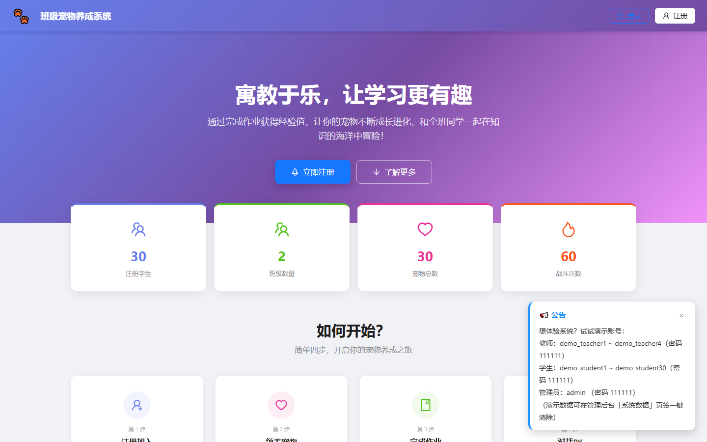

<div align="center">

# 班级宠物养成系统

**让学习充满乐趣，和同学一起养育专属宠物**

[](https://nodejs.org)
[](https://react.dev)
[](https://www.typescriptlang.org)
[](https://expressjs.com)
[](#许可证)

通过完成作业、每日任务、battle 对战等方式培养专属宠物，实现寓教于乐的学习体验

[快速开始](#快速开始) · [功能特性](#功能特性) · [部署](#部署) · [技术栈](#技术栈) · [API 概览](#api-概览)

</div>

---

## 界面预览

<div align="center">
<table>
<tr>
<td width="50%"></td>
<td width="50%"></td>
</tr>
<tr>
<td align="center"><sub>登录页</sub></td>
<td align="center"><sub>产品落地页</sub></td>
</tr>
</table>
</div>

---

## 这是什么

一个**面向中小学课堂**的教学平台。它把作业、批改、学情分析这些日常教学环节，和宠物养成、班级社交、游戏化激励缝在一起，让学生有持续的学习动力，让老师拿到真正用得上的学情数据。

**它解决的三个真实问题：**

| 问题 | 做法 |
|---|---|
| 学生对作业没兴趣 | 学习行为直接转化为宠物成长与班级荣誉 |
| 老师批改负担重 | AI 出题 + 客观题自动批改 + 主观题 AI 评分 |
| 住校生没有设备 | 纸质卷打印 → 学生笔答 → 拍照上传 → AI 认姓名判分，全程不需要设备 |

---

## 功能特性

### 教学闭环

<table>
<tr>
<td width="50%" valign="top">

**AI 出题**

- 按知识点出题 / 按详细要求出题
- 一次可配置**多种题型**（单选、多选、判断、填空、简答），各自设定数量与难度
- 客观题自动配 2 个相似变体，学生做错时能立刻练同类题
- 也可直接**粘贴题目原文**，由 AI 逐题自动判断题型并补全选项与答案

</td>
<td width="50%" valign="top">

**纸质作业闭环（住校生无设备）**

1. 发布时选「预习」，列表点「打印」，按名单预填姓名生成 A4 卷
2. 学生笔答
3. 收齐后拍照上传（一次最多 12 张）
4. 视觉大模型识别卷面姓名**自动归人**，逐题判分
5. 人工校对未识别的份
6. 一键批量登记

</td>
</tr>
</table>

### 学情分析

- **学情报告**：按「班级 × 学科 × 时间段」组合出报告，含 KPI、趋势、知识点掌握热力矩阵、需关注名单
- **AI 成因分析与教学建议**，可导出 Excel/CSV，按班级存档留历史
- **数据口径严格**：正确率按答题量加权；任课教师只看自己学科，班主任看全科

### 班级与权限

系统的权限模型分三层，是整个后台设计的基础：

| 角色 | 能做什么 |
|---|---|
| **管理员** | 全部权限：教师/学生/班级/学校管理、审批、公告、数据清理、软件升级 |
| **班主任** | 本班全权：审批入班申请、增删本班任课教师、管理本班学生内容、终止本班 BOSS 战 |
| **任课教师** | 教学产出：布置作业、创建本班 BOSS 战、查看自己学科的学情 |

几条贯穿全系统的规则：

- **入班申请只通知班主任**；班级没有班主任时，自动兜底通知管理员处理
- **教师可自助维护任教科目**（即时生效），但**加入班级需班主任审批**——因为任教班级意味着学生名单、班级群、申请通知的可见权
- **同班只能有一位班主任**，且教师只能任教自己所在的班级

### 游戏化系统

<div align="center">


<br>
<sub>32 种宠物 · 5 属性 · 火→草→水→火 循环克制，光暗互克</sub>
</div>

| 模块 | 说明 |
|---|---|
| **宠物养成** | 32 种宠物、7 阶段进化（宠物蛋→究极体）、属性/心情/饥饿度、技能培养 |
| **战斗** | 1v1 对战、好友对战、班级 BOSS 战；克制方 ×1.25、被克方 ×0.8 |
| **错题本** | 错题可重做，**连续答对 2 次**才移出；完整保留重做历史 |
| **个人题库** | 每次作答自动沉淀做过的**全部**题目（不只错题） |
| **社交** | 班级群聊、班级动态、论坛、好友、礼物 |
| **成长激励** | 成就、排行榜、每日任务、卡兑换 |

### 运营开关

管理后台内置功能开关，**同时作用于前端界面与后端接口**（关掉后接口会真正拒绝请求，而不是只隐藏入口）：

| 分组 | 开关 |
|---|---|
| 注册与对外访问 | 开放注册、班级公开主页 |
| AI 能力 | **AI 总闸**、AI 批改纸质作业、纸质作业拍照上传 |
| 游戏化玩法 | PVP 对战、BOSS 战、道具商店、装备商店 |
| 教学协作 | 跨教师作业可见（默认关闭） |

> AI 总闸是唯一的「一键止血阀」：LLM 出故障、异常刷量或只想省 Token 时，可在此停掉全部 AI 能力。

---

## 快速开始

### 方式一：Docker 一键部署（推荐）

```bash
curl -L -O https://gitee.com/interim/pet/raw/main/deploy.sh
chmod +x deploy.sh
./deploy.sh
```

脚本会引导你输入域名、API Key，自动完成：安装 Docker → 拉取镜像 → 启动服务 → 配置 HTTPS。

详见 [部署指南.md](./部署指南.md)。

### 方式二：本地开发

**环境要求**：Node.js >= 18、npm >= 9

```bash
# 后端
cd backend
npm install
cp .env.example .env      # 填入 AI_API_KEY 等
npm run migrate           # 建表 + 种子数据（首次必做）
npm run dev                # http://localhost:3000

# 前端（另开一个终端）
cd frontend
npm install
npm run dev                   # http://localhost:5173
```

> ⚠️ `npm start` **只启动服务、不建表**。新服务器直接启动会出现「服务能开但所有接口报 `no such table`」。

**预置账号**（密码均为 `111111`）：

| 角色 | 账号 |
|---|---|
| 管理员 | `admin` |
| 教师 | `demo_teacher1` ~ `demo_teacher4` |
| 学生 | `demo_student1` ~ `demo_student30` |

需要更多演示数据：管理后台 → 系统数据 → 导入演示数据（可一键清除，不影响真实账号）。

---

## 部署

生产环境跑 Docker，编排文件用 `image:` 而非 `build:`，从阿里云 ACR 拉取预构建镜像。

```bash
# 开发机：构建并推送
docker build -t registry.cn-hangzhou.aliyuncs.com/myfdocker/pet:latest .
docker push registry.cn-hangzhou.aliyuncs.com/myfdocker/pet:latest

# 服务器：拉取并重启
cd /opt/pet
docker compose pull && docker compose up -d
```

| 事项 | 说明 |
|---|---|
| 数据库 | 挂在宿主机 `./data:/app/data`，**重建容器不丢数据** |
| 迁移 | 容器启动自动跑 `knex migrate:latest`，无需手动执行 |
| 密钥 | 由 `docker-compose.yml` 的 `environment` 传入，不要打进镜像 |
| CORS | `FRONTEND_URL` 必须与浏览器地址栏的**协议+域名+端口**完全一致，否则接口会被拒 |

站点内置「管理后台 → 系统设置 → 软件升级」，填一次更新源地址后，管理员点「检查更新 → 立即升级」即可完成**程序 + 数据库结构**升级（自动备份、校验 sha256、失败可回滚）。流程见 [发布指南.md](./发布指南.md)。

---

## 技术栈

<table>
<tr><td width="50%" valign="top">

**后端**

- Node.js + Express 4
- SQLite（better-sqlite3，单文件，零运维）
- Knex.js（数据库迁移）
- Socket.IO（实时通信）
- JWT 鉴权
- AI 大模型接入（火山方舟 / OpenAI 兼容网关）

</td>
<td width="50%" valign="top">

**前端**

- React 18 + TypeScript
- Vite（构建 / 分包）
- Ant Design 5
- Zustand（状态管理）
- 图表：AntV Charts

</td>
</tr>
</table>

### 项目结构

```
pet/
├── backend/
│   ├── migrations/        # 数据库迁移（001 ~ 017）
│   ├── seeds/             # 种子数据
│   └── src/
│       ├── config/        # 配置（database / ai / timezone / prompts）
│       ├── middleware/    # 鉴权、班级权限、功能开关、Agent 鉴权
│       ├── services/      # 业务服务（奖励 / AI 额度 / 出题 / 演示数据 / 入班通知）
│       ├── routes/        # API 路由
│       │   └── admin/     # 管理后台子路由
│       └── server.js      # 入口
├── frontend/
│   └── src/
│       ├── components/    # 组件（含 admin/ 管理后台组件）
│       ├── pages/         # 页面
│       ├── store/         # 状态管理
│       └── utils/         # 工具（api 封装 / 权限判定 / 试卷生成）
├── scripts/e2e/           # 端到端探针脚本
├── deploy.sh              # 一键部署
└── docs/manual/            # 用户手册（教师 / 学生 / 管理员）配图
```

---

## 关键设计说明

### 为什么用 SQLite

整个系统所有数据都在**一个文件**里，备份就是复制这个文件。对校园网 / 单机部署来说，这比装一套 MySQL 简单得多。代价是并发写入上限，但教学场景的写入量远达不到瓶颈。

### AI 能力是可插拔的

所有 AI 提示词都放在 `backend/src/config/prompts/`，**可在管理后台直接改并热生效**，不需要改代码重新部署。出题、批改、教练、学情报告各有独立模板。

同时所有 AI 入口都做了**额度 + 开关**双重管控：每日生成次数、全站 Token 上限、单次最大题量，都能在后台调整。

### 纸质作业的姓名识别

批量扫描时，视觉大模型先识别每张卷面的姓名，再归到对应学生。姓名识别失败的不丢弃，而是标红「待指派」，由老师下拉手动指定——避免因为字迹潦草导致整份成绩丢失。

### 功能开关是真开关

很多系统的「开关」只是前端隐藏入口，直接调接口照样能用。这里的开关在**后端路由层**拦截，关掉后接口返回 403，开关清单统一由 `middleware/featureFlags.js` 管理，不存在两处维护而漏项的问题。

### 角色分层

班主任与任课教师的区分不是 `user.role`，而是 `class_teachers.role = head_teacher`——同一个人可能既是A 班班主任又是 B 班任课教师。所有权限判定都以「在某个班是否任教」为基准，而不是给用户贴一个全局标签。

```
管理员        → 全局
班主任        → 本班（任教 + 班主任标记）
任课教师      → 自己任教的班（可多班）
```

---

## API 概览

| 模块 | 端点 |
|---|---|
| 认证 | `/api/auth/register`、`/login`、`/me` |
| 宠物 | `/api/pets/my-pet`、`/create`、`/feed` |
| 作业 | `/api/assignments`、`/:id/submit` |
| 作业统计 | `/api/assignments/stats/type-summary` |
| 纸质作业 | `/:id/paper-submit`、`/ai-paper-judge`、`/ai-paper-judge-batch` |
| 个人题库 | `/api/assignments/personal-bank/my`、`/stats` |
| 错题本 | `/api/assignments/wrong/my`、`/:id/review`、`/retry` |
| 学情报告 | `/api/learning-reports/overview`、`/knowledge-matrix`、`/students`、`POST /ai-report` |
| 知识点 | `/api/knowledge-points/heatmap`、`/weak-points`、`/review-effectiveness` |
| 课堂做题 | `/api/cards/classroom-quizzes/*` |
| AI 直连 | `/api/agent/*`、`/api/skills/install/:slug` |
| 战斗 / BOSS | `/api/battles/*`、`/api/boss-battles/*` |
| 管理后台 | `/api/admin/*` |

> 学情类接口按角色隔离：班主任看全科，任课教师仅看自己所授学科，学生访问返回 403。

---

## 环境变量

```bash
PORT=3000
NODE_ENV=production
JWT_SECRET=your-secret-key
JWT_EXPIRES_IN=7d

# AI 服务（数据库 settings 表里的 ai_* 优先级更高，此处仅作 fallback）
AI_API_KEY=your-api-key
AI_BASE_URL=https://ark.cn-beijing.volces.com/api/v3
AI_MODEL=doubao-seed-2-0-pro-260215

# 前端地址（CORS + 邀请链接），多个用逗号分隔
FRONTEND_URL=https://your-domain.com
```

AI 配置均可在**管理后台 → AI 设置**中修改，存于数据库，**优先级高于 `.env`**。其中「视觉模型」单独配置，用于纸质作业照片识别。

---

## 常见问题

| 现象 | 原因与解决 |
|---|---|
| 服务能开但接口报 `no such table` | 数据库没初始化。跑 `npm run migrate` 后重启 |
| 页面白屏 | 前端 `dist` 未更新。重新 `npm run build` 并覆盖，浏览器 `Ctrl+F5` |
| 接口报「不允许的跨域请求」 | `FRONTEND_URL` 与浏览器地址栏不一致（协议 / 域名 / 端口任一处不同都会被拒） |
| 登录后过一会要重新登录 | 多实例共用 `JWT_SECRET`，每个实例要配不同值 |
| AI 相关功能报错 | 后台 → AI 设置里检查模型和 Key；批量扫描还需配「视觉模型」 |
| 错题本显示 `Invalid Date` | 迁移未执行，`npm run migrate` 后重启 |
| build 后某些页面白屏 | 用 `npm ci --omit=dev` 会缺 devDependencies 导致类型检查失败，改用完整 `npm install` |

更多见 [部署指南.md](./部署指南.md)。

---

## 文档

### 用户手册

面向最终用户，不含任何部署内容，配图取自真实运行环境，可直接发给老师和学生。

| 手册 | 适合谁 | 内容 |
|---|---|---|
| [学生手册](./docs/manual/学生手册.md) | 学生 | 做作业、养宠物、PVP / BOSS 对战、卡兑换、成就 |
| [教师手册](./docs/manual/教师手册.md) | 老师 / 任课教师 | 布置作业、批改与统计、学情报告、课堂做题、BOSS 战管理 |
| [管理员手册](./docs/manual/管理员手册.md) | 校长 / 信息员 | 开账号与审批、配置 AI、数据导出、软件升级、清理数据 |

### 技术文档

| 文档 | 内容 |
|---|---|
| [部署指南.md](./部署指南.md) | 部署方式选择、速查表、故障对照表、数据库迁移 |
| [手动部署指南.md](./手动部署指南.md) | 不用 Docker 的部署方式（Windows + 宝塔） |
| [发布指南.md](./发布指南.md) | 制作升级包与发布流程 |
| [docs/冒烟清单.md](./docs/冒烟清单.md) | 上线前逐项验证清单 |

---

## 许可证

[MIT](./LICENSE)
