# 学生手册

> 班级宠物养成系统 · 学生版
> 网址：`https://pet2.uwper.cn`

---

## 目录

1. [第一次使用](#一第一次使用)
2. [认识你的首页](#二认识你的首页)
3. [学习中心](#三学习中心)
4. [宠物中心](#四宠物中心)
5. [班级](#五班级)
6. [成就](#六成就)
7. [卡兑换](#七卡兑换)
8. [通知](#八通知)
9. [个人中心](#九个人中心)
10. [常见问题](#十常见问题)

---

## 一、第一次使用

### 1.1 打开网站

在浏览器地址栏输入 `https://pet2.uwper.cn`，按回车。

### 1.2 注册账号

点击登录页下方 **「立即注册」**。

| 要填的东西 | 怎么填 |
|---|---|
| 用户名 | 建议用「学号_姓名」，例如 `20260101_张三`，全系统唯一，以后不能改 |
| 密码 | 至少 6 位，自己记住 |
| 真实姓名 | 填自己的姓名 |
| 班级 | 如果老师已经建好班级，选对应班级；没有就选「暂不加入」，之后再申请 |

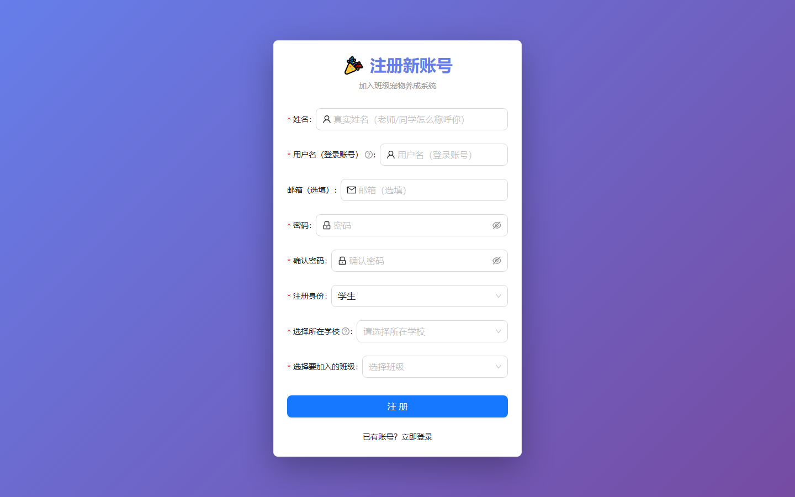

> **注意**：如果老师给了你**邀请码**，注册时填上邀请码就能直接进班级，不用等审批。

### 1.3 领养你的第一只宠物

注册并登录后进入 **宠物中心 → 我的宠物**，选一只喜欢的宠物领养。

---

## 二、认识你的首页

登录后你看到的就是首页。

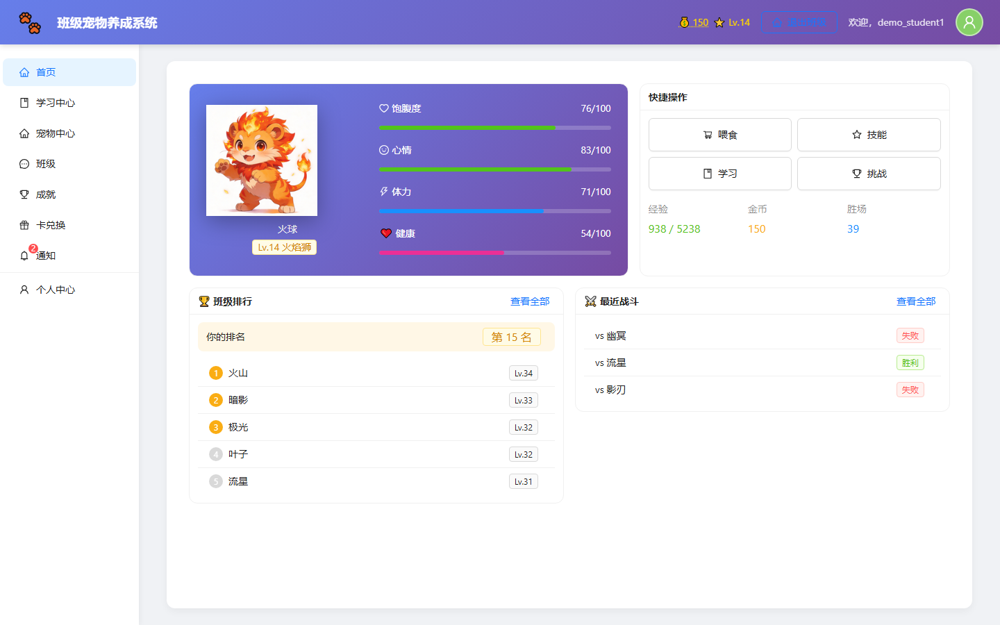

从上到下依次是：

| 区域 | 说明 |
|---|---|
| 顶部右上角 | 你的金币数、班级徽章、**通知**（有新消息会显示红点） |
| 左侧菜单 | 所有功能的入口，按这个找功能就行 |
| 宠物状态卡 | 饱腹度、心情、体力、健康四条进度条，快掉到底了记得喂食 |
| 快捷操作 | **喂食 / 技能 / 学习 / 挑战** 四个按钮，最常用 |
| 我的数据 | 经验、金币、胜场 |
| 班级排行 | 你在本班的排名，点「查看全部」看全班 |
| 近期战斗 | 最近的对战结果（胜利 / 失败） |

### 最重要的一件事：怎么让宠物变强

> **完成作业 → 获得经验值和金币 → 宠物升级 → 挑战更强对手**

只要坚持做作业、按时喂食，宠物就会一直变强。这套系统的所有功能都是围绕这一条主线服务的。

---

## 三、学习中心

左侧菜单点 **学习中心**。

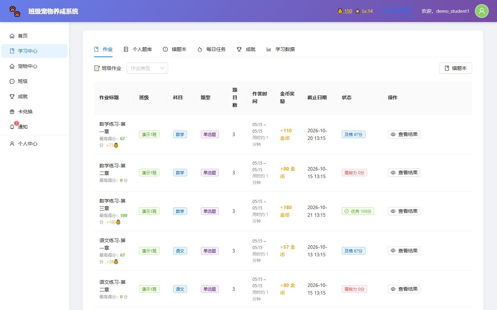

里面有 6 个页签，下面逐个说。

### 3.1 作业 —— 最重要

这是老师布置的作业。列表里能看到作业标题、科目、题目数量、截止时间和你的完成状态。

**做作业的步骤：**

1. 点作业标题，进入作业详情
2. 选择答案（单选点一下即可，多选和填空要手动填）
3. 点 **提交**
4. 提交后不能再改，务必检查一遍再交

**批改结果去哪看？**

老师批改后，你会收到 **通知**（右上角红点），告诉你得了多少分、错了哪几题。错的题会自动进入 **错题本**。

### 3.2 个人题库

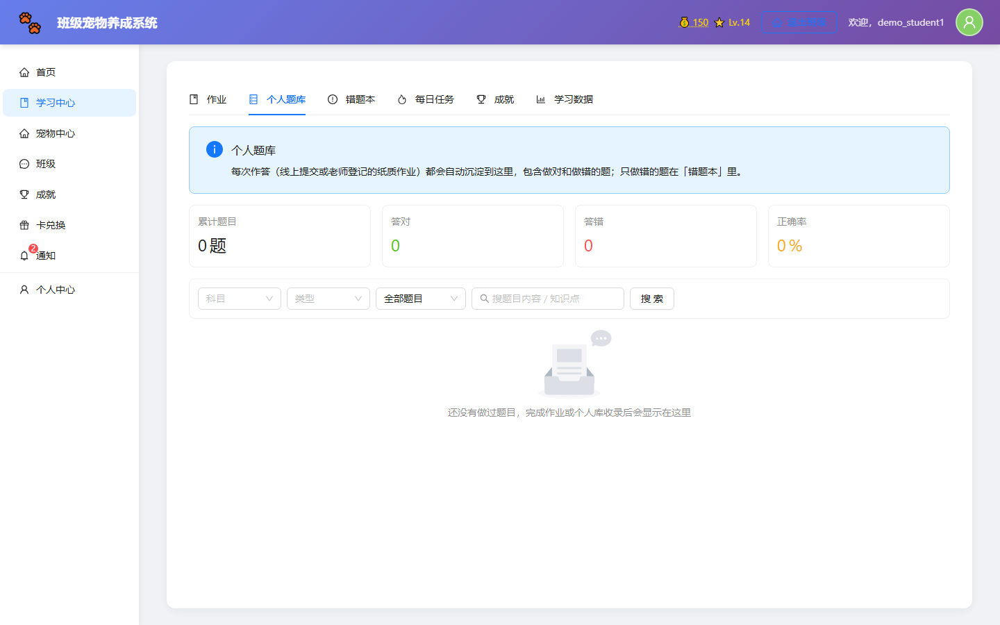

老师给你布置的题、你做错过的题，都可以存在这里。

- **查看**：按科目、题型筛选
- **加入**：在作业里遇到好题，可以点「加入我的题库」存起来，以后复习用
- **重做**：错题可以随时重做

### 3.3 错题本

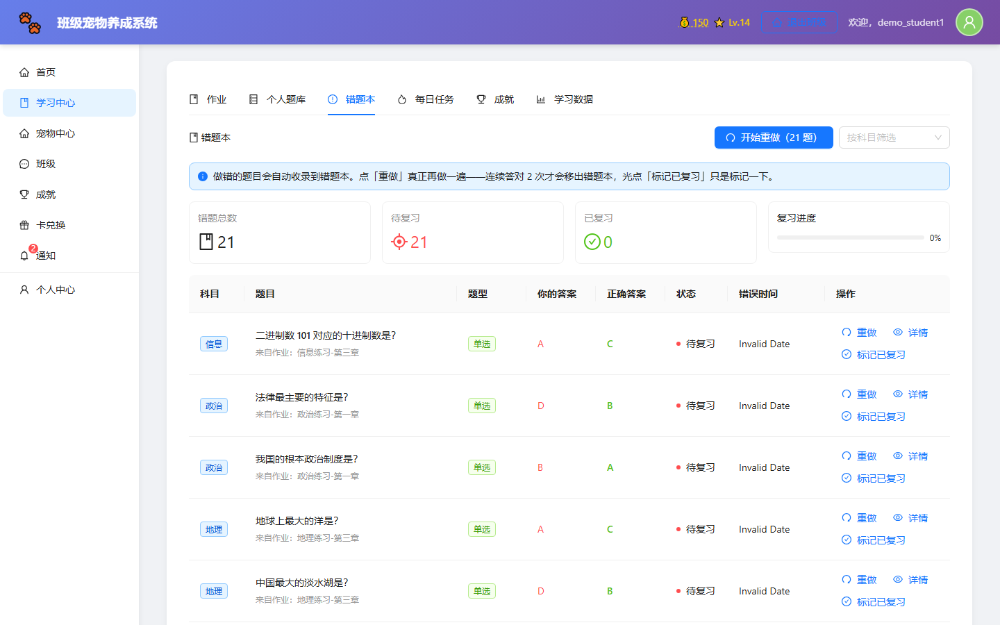

做错的题会自动收进来。这里可以：

- 看错题的正确率和掌握程度
- 点「重做」再练一次
- 标记为「已订正」，表示我已经弄懂了

> 建议每周花 10 分钟把错题本过一遍，比多做 5 道新题有用。

### 3.4 每日任务

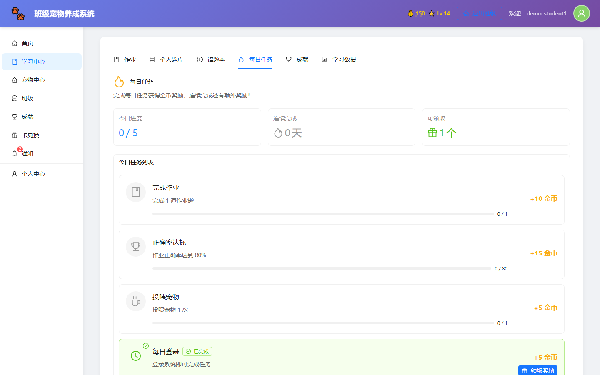

每天都有几个小任务，比如「完成 1 份作业」「登录 1 次」。点 **领取** 就能拿到奖励。

> 每天来看看，奖励可以攒起来买装备和技能。

### 3.5 学习数据

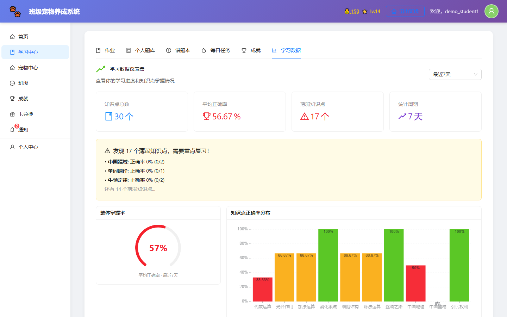

你自己的学习报告：做了多少题、正确率多少、哪些知识点薄弱、连续学习多少天。

- **正确率**：总体掌握情况
- **薄弱知识点**：系统自动统计出来，红色越多说明越该复习
- **学习热力图**：颜色越深的日子，说明当天学得越多

### 3.6 成就

学习相关的成就，比如「连续签到」「满分作业」。

---

## 四、宠物中心

左侧菜单点 **宠物中心**。这是系统的核心玩法。

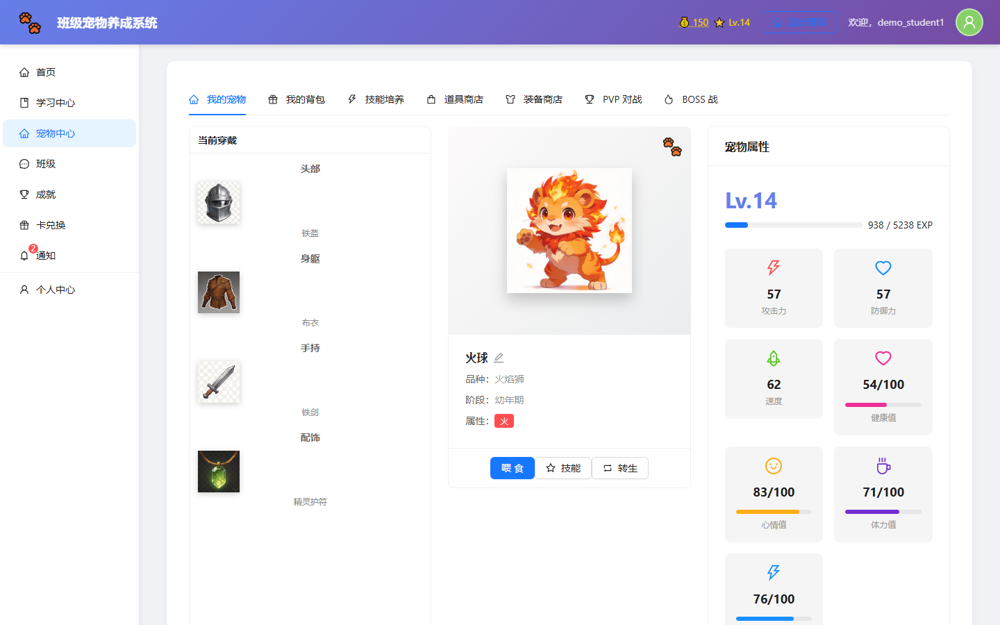

### 4.1 我的宠物

宠物有 4 条状态：

| 状态 | 低了会怎样 | 怎么补 |
|---|---|---|
| 饱腹度 | 饿肚子，不涨经验 | 喂食 |
| 心情 | 心情低会生病 | 陪玩 / 喂食 |
| 体力 | 没体力打不了仗 | 休息 / 喂食 |
| 健康 | 健康低了会生病 | 买药 / 休息 |

**升级**：经验值攒够就会自动升级。Lv.14 就是升级了 14 次。

**进化**：等级达到要求可以进化成更厉害的形态。

### 4.2 喂食

在首页点 **喂食**，或者在「我的背包」里用道具。食物有不同种类，恢复的效果不一样。

> 提示：道具用完了可以去 **道具商店** 买，金币就是靠做作业赚的。

### 4.3 我的背包

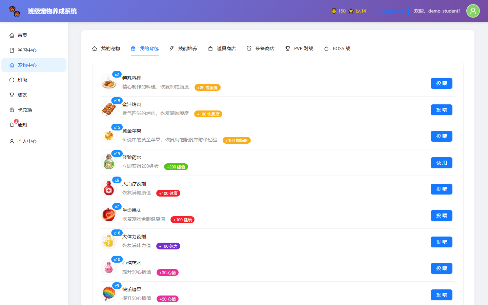

你所有的食物、药品、材料都在这里。可以查看数量和使用。

### 4.4 技能培养

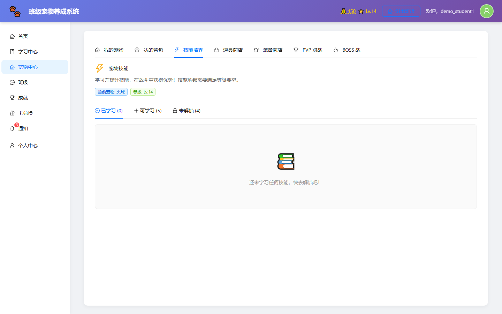

用金币和材料给宠物学新技能，或者升级已有技能。技能等级越高，战斗越厉害。

### 4.5 道具商店

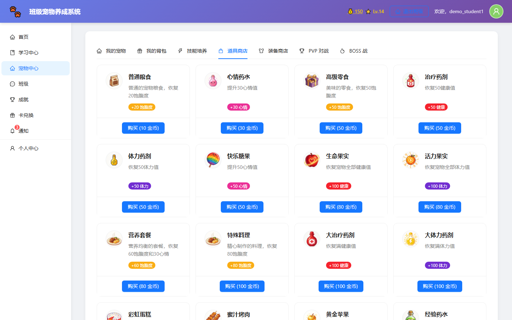

用金币买食物、药品、材料。金币来自做作业和每日任务。

### 4.6 装备商店

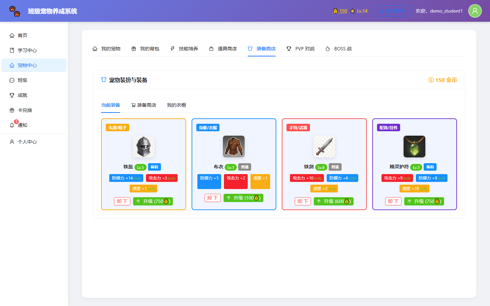

用金币买装备。装备穿戴到宠物身上后，攻击、防御、速度会提升。

- 背包 → 装备 → 拖到宠物身上 → **穿戴**
- 换装备时先卸下旧的

### 4.7 PVP 对战

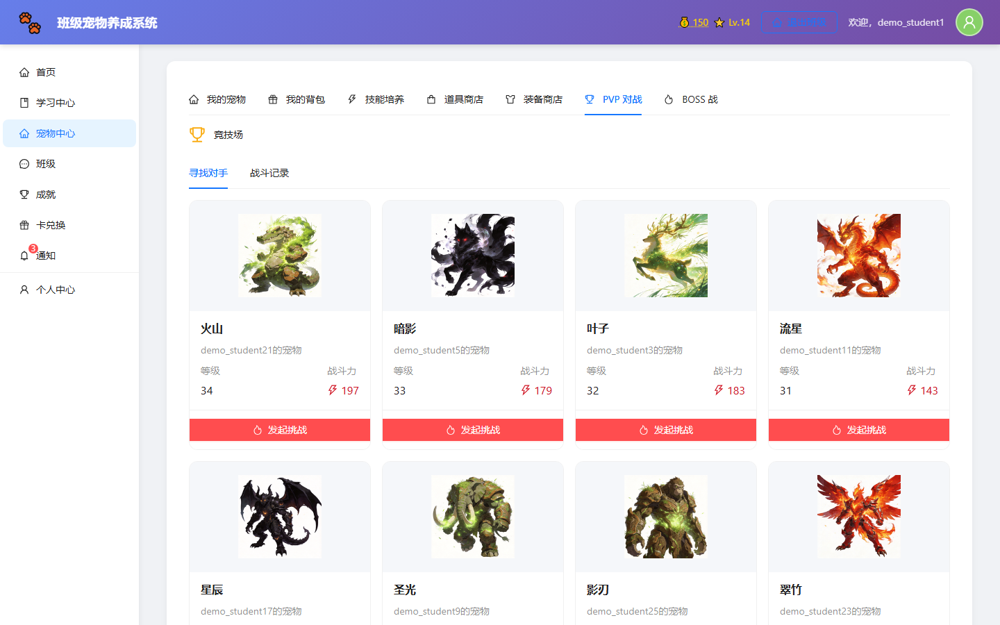

挑战本班其他同学的宠物。系统会按综合属性自动匹配对手，也可以自己选。

**对战流程**：系统随机出题（多半是你学过的知识点），你和你对手同时抢答 —— **答对得高分，答错扣分**，最后分数高的赢。

> 建议：级别差不多的时候先去「学习中心」补补薄弱知识点再来打，否则会连输。

### 4.8 BOSS 战

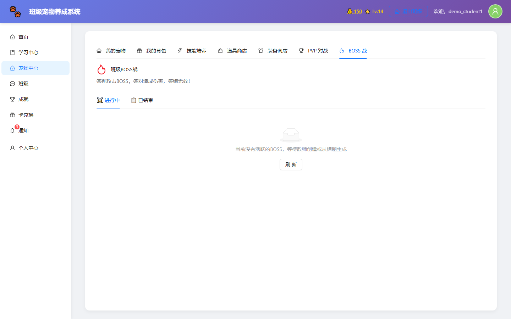

全班一起打 BOSS。BOSS 有血量，每答对一题就掉血，全班共享进度。

- 先点 **查看题目** 了解题型
- 点 **攻击** 进入答题
- 答对扣血，答错不扣
- 血量清零后，**全班一起领奖励**

> BOSS 是全班共同的，别一个人偷偷打，答案是共享的。

---

## 五、班级

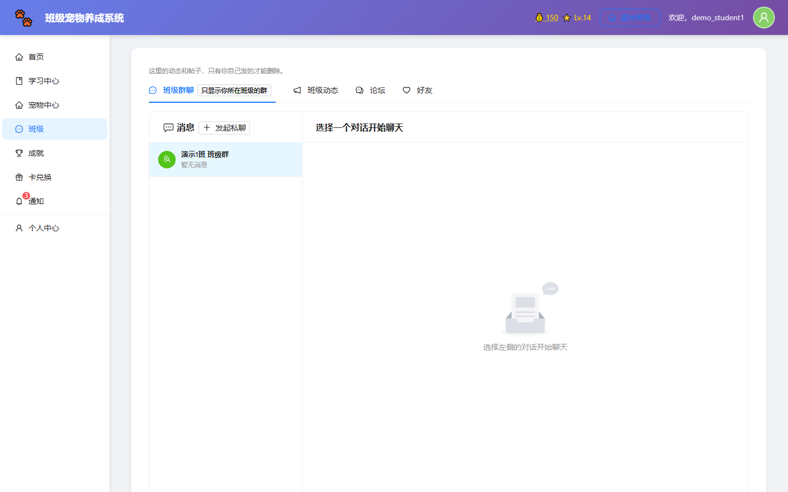

### 5.1 班级群聊

和本班同学聊天的地方。可以发文字、图片。

### 5.2 班级动态

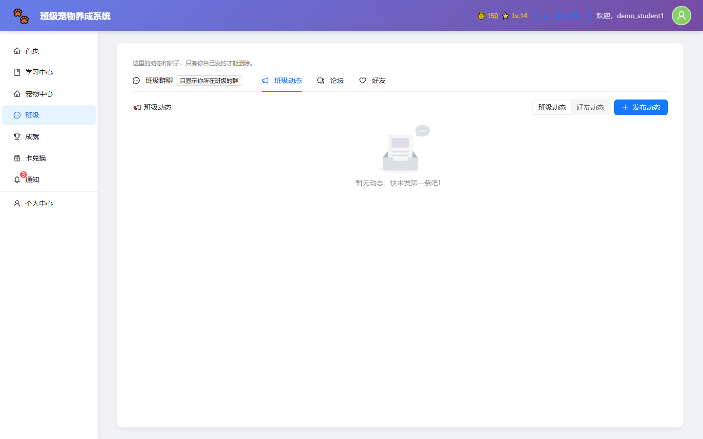

发布班级内的帖子，可以点赞、评论。像一个班级版的小论坛。

### 5.3 论坛

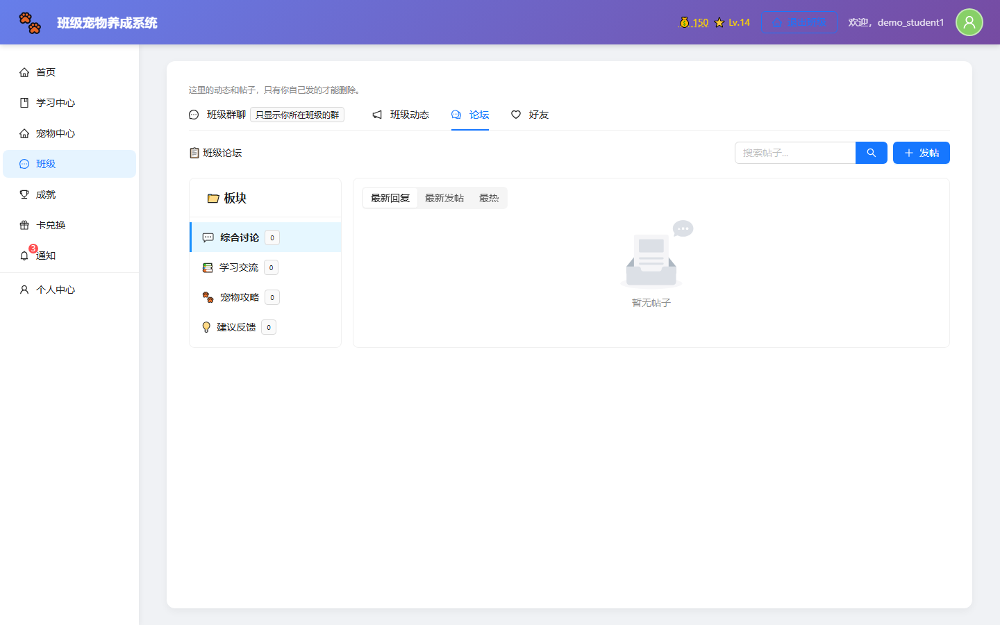

全校范围的帖子区，可以看看别的班在聊什么。

### 5.4 好友

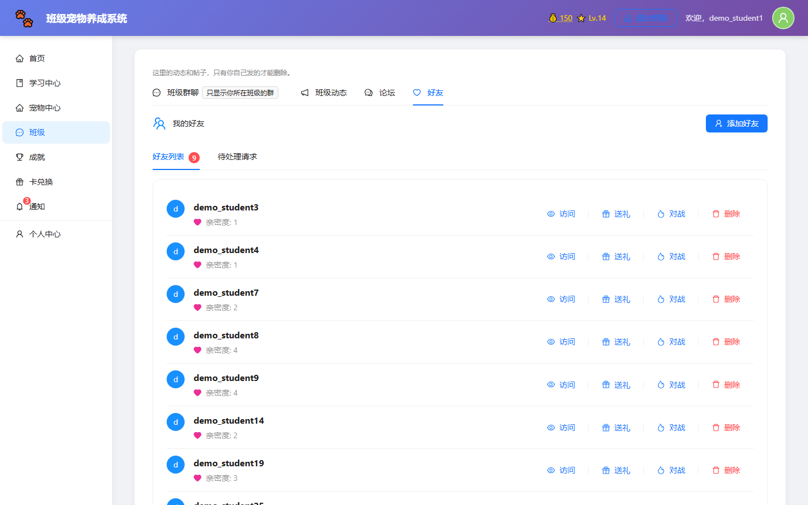

加同学为好友，好友之间可以**赠礼**和**切磋**。

---

## 六、成就

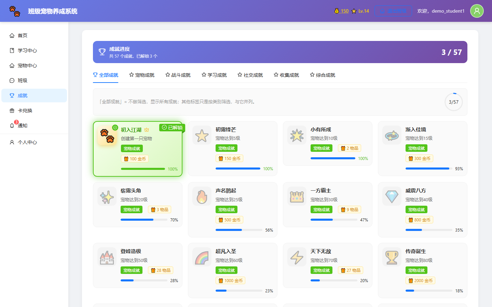

系统把成就分成 6 类，每类都有自己的徽章：

| 分类 | 例子 |
|---|---|
| 学习成就 | 连续学习、满分作业 |
| 战斗成就 | 获胜场次、BOSS 伤害 |
| 宠物成就 | 等级、进化次数 |
| 收集成就 | 图鉴、道具收集 |
| 社交成就 | 发帖、好友数 |
| 综合成就 | 总积分、总等级 |

完成条件后成就自动点亮，**不需要手动领取**。点进每个分类能看到「全部成就」和已完成的进度。

---

## 七、卡兑换

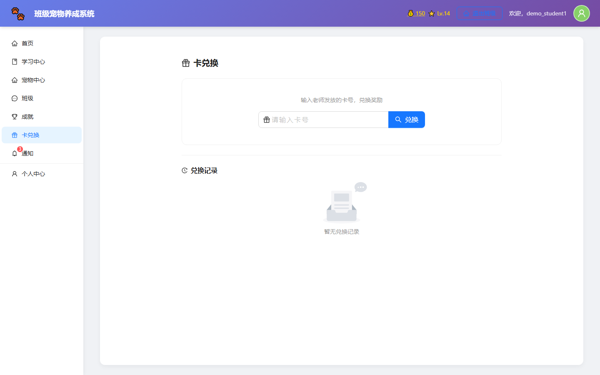

老师或学校会发「卡」给你（实体卡的卡号，或电子卡密）。

1. 输入卡号
2. 点兑换
3. 卡里的奖励直接进你的背包 / 金币 / 经验

> 卡可以重复兑换直到用完为止，注意别把卡号告诉别人。

---

## 八、通知

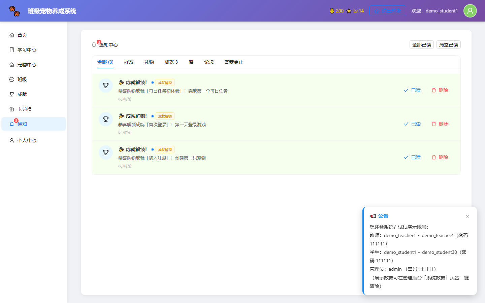

右上角铃铛图标，有新消息会显示红点。通知分 4 类：

| 类型 | 内容 |
|---|---|
| 全部 | 所有通知 |
| 系统 | 系统公告 |
| 答案更正 | **老师批改后的批改结果**（重要！第一时间看） |
| 论坛 | 你发的帖子/评论有人回复 |

---

## 九、个人中心

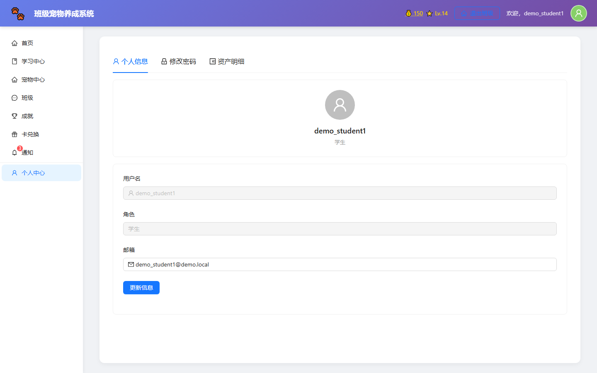

| 页签 | 能做什么 |
|---|---|
| 个人信息 | 改头像、改真实姓名、改邮箱、改密码 |
| 修改密码 | 建议每学期换一次 |
| 资产明细 | 查金币/道具的收支流水，每一笔都有来源记录 |

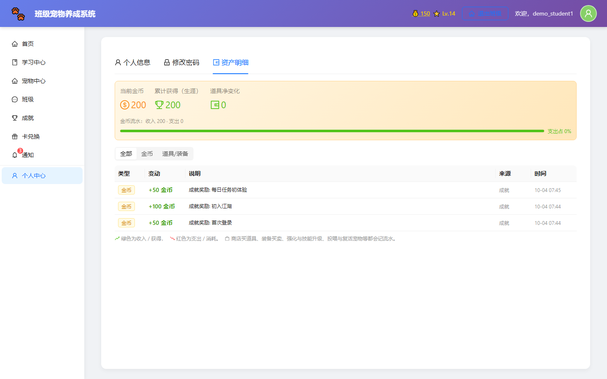

---

## 十、常见问题

**Q1：忘记密码了怎么办？**
在登录页点 **「查询注册/入班审批进度」**，可以查看注册是否通过。密码忘了要联系班主任或老师重置。

**Q2：为什么我的宠物一直在掉血？**
饱腹度、心情、体力或健康掉到底了。去 **喂食**、使用药品，或者让它休息一会儿。

**Q3：作业提交错了能改吗？**
**不能。** 提交前一定要检查。这是计分作业，请认真核对。

**Q4：为什么我打不了某些人？**
对方可能级别或段位太高，超出了可挑战范围。先把自己的宠物养强。

**Q5：金币不够用怎么办？**
做作业、完成每日任务都能赚金币。金币不够就先去完成几份作业。

**Q6：我的数据会被别人看到吗？**
只有你的昵称、班级、等级、排行会展示给同学。老师可以在管理后台查看你的学习数据（正确率、作业情况），这是为了帮助你进步。

**Q7：老师看不到我做什么？**
老师能看到作业完成情况，但看不到你在游戏里买了什么、喂了几次食。

**Q8：页面打不开或加载不出来？**
先刷新（`Ctrl + F5` 强制刷新）；还不行就换个浏览器或检查网络。

---

*祝你和你的宠物一起茁壮成长！*
