# 教师手册（教师版）

> 班级宠物养成系统 · 教师版
> 网址：`https://pet2.uwper.cn`

## 目录

1. 登录与工作台
2. 班级管理
3. 布置作业（核心）
4. 批改与统计
5. 题库
6. 学情报告与看板
7. 课堂做题
8. BOSS 战管理
9. 沟通
10. 卡管理
11. 通知与答案更正
12. 常见问题

---

## 一、登录与工作台

### 1.1 登录

浏览器打开 `https://pet2.uwper.cn`，输入账号密码。

> 账号由学校管理员发放，初始密码通常是 `111111`，首次登录后请到「个人中心 → 修改密码」改掉。

登录后点击左侧菜单「工作台」进入管理界面。

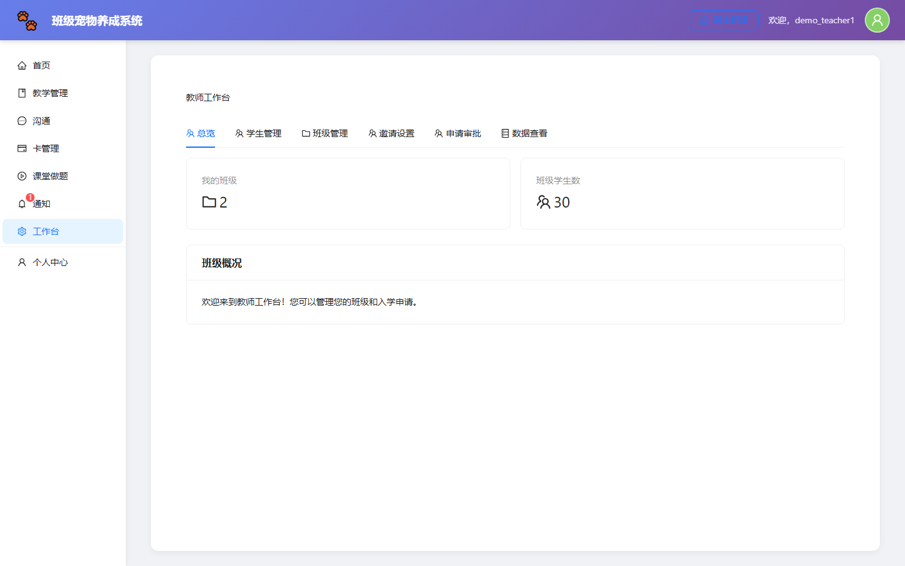

### 1.2 工作台六个页签

| 页签 | 用途 |
|---|---|
| 总览 | 今天的整体情况：作业完成率、学生活跃度 |
| 学生管理 | 查看/搜索本班学生，重置密码，查看个人学习数据 |
| 班级管理 | 改班级名、封面、公开主页、邀请码管理 |
| 邀请设置 | 批量生成邀请码，可设使用次数和有效期 |
| 申请审批 | 审批学生加入本班、任教申请 |
| 数据查看 | 自由组合条件，导出数据为 Excel |

### 1.3 学生管理

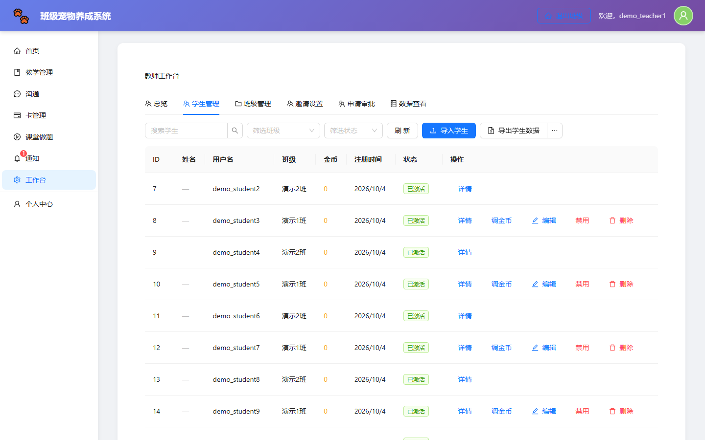

- 搜索：按姓名或账号查
- 重置密码：学生忘了密码时用这个，生成 6 位临时密码
- 查看详情：可以看这个学生的作业记录和正确率

> 批量导入学生用「数据查看 → 导入」，支持 Excel 模板和粘贴名单两种方式。

---

## 二、班级管理

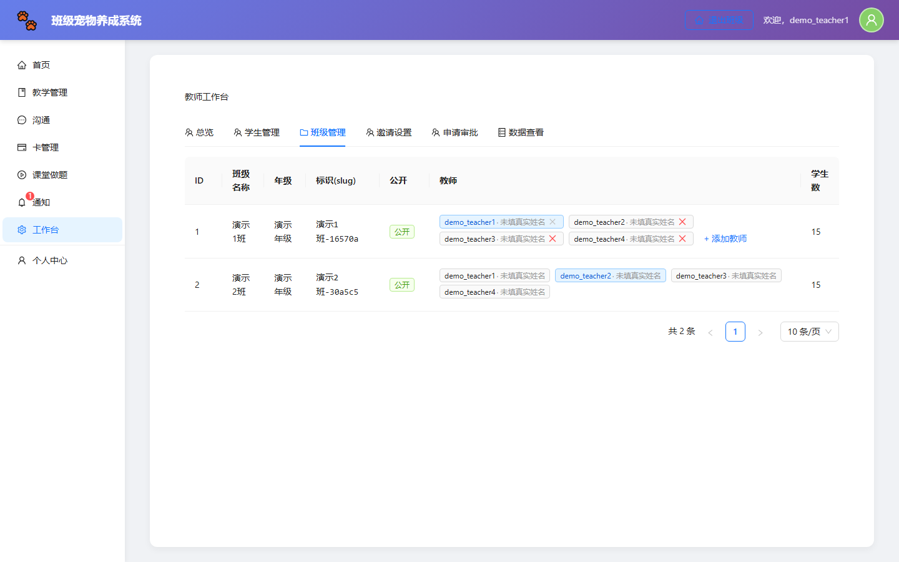

| 能改什么 | 说明 |
|---|---|
| 班级名称 | 改完学生端会同步显示 |
| 班级封面 | 上传一张图片 |
| 公开主页 | 打开后学生能通过链接访问班级页面 |
| 班级专属链接 | 学生的公开主页地址，可以分享给家长 |

### 邀请码

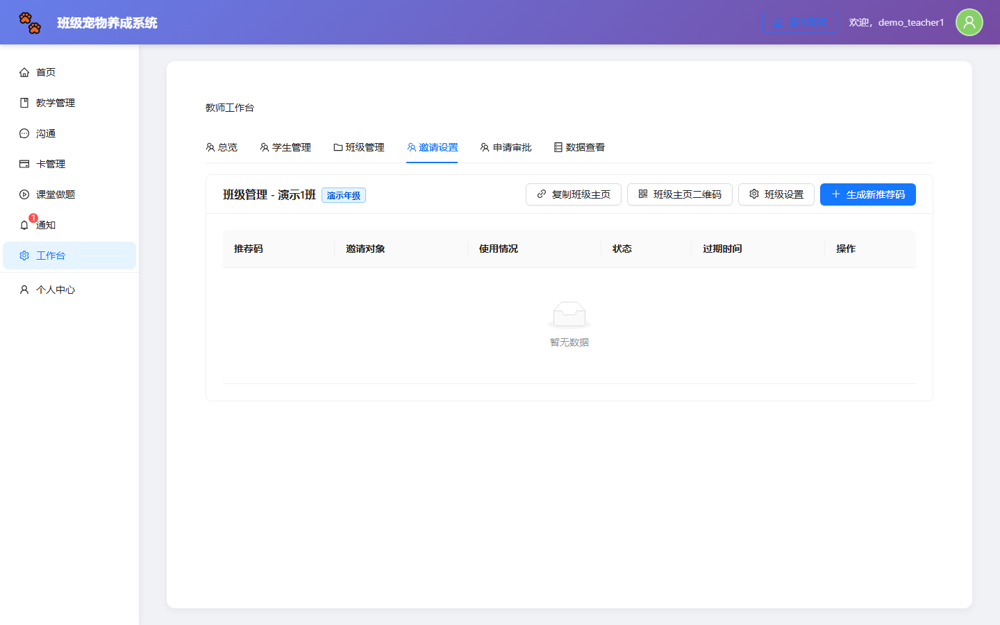

点击「生成邀请码」，可以设置：

- 角色：学生 / 任课教师
- 可使用次数：人数上限（比如 50 个）
- 有效期：过期自动失效

把邀请码发给学生或同事，他们注册时填上就能直接进来，不需要走审批。

> 家长或校外人员使用：注册页填邀请码即可自动入班。

### 申请审批

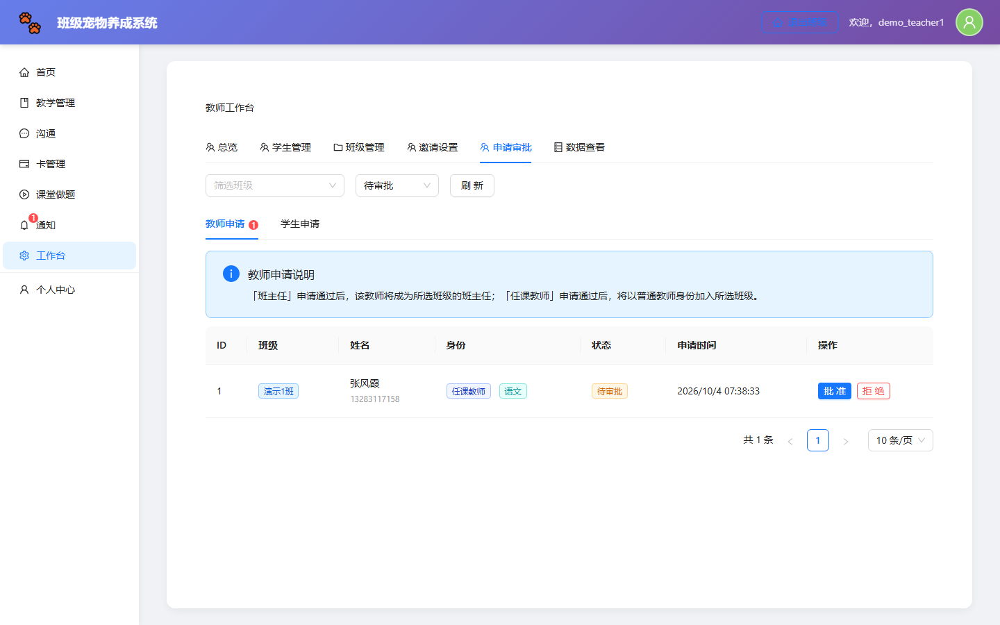

没有邀请码的学生可以自己申请加入班级，教师在这里审批通过。

---

## 三、布置作业（核心）

左侧菜单「教学管理 → 作业管理」。

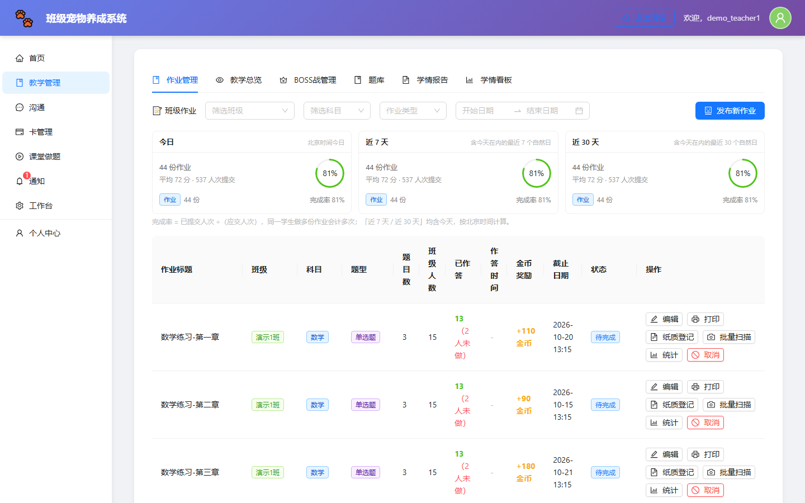

页面顶部三个关键数字卡片：今日、近 7 天、近 30 天，分别显示发布份数、平均提交人次和完成率。

> 完成率 = 已提交人数 ÷ 应交人数。同一学生在同一时段做的多份作业只计一次，避免刷完成率。

### 3.1 发布新作业

点右上角「发布新作业」，有三种出题方式：

#### 方式一：AI 出题（最快）

1. 选科目
2. 填「主题」，例如「分数的初步认识」；或者直接把要讲的题目粘贴进去，系统自动识别
3. 选难度、题型、数量
4. 预览生成结果
5. 满意就发布；不满意可以「放弃重出」（放弃会退还生成额度，不扣分）

> 支持多种题型混合（单选 + 多选 + 填空 + 判断），可按题量分组。生成前请确认管理员已配置好 AI。

#### 方式二：从题库选题

到「题库」里按科目、知识点筛选，把合适的题加入作业。

#### 方式三：手工录入

直接输入题目、选项、答案、解析。

### 3.2 作业列表的操作按钮

| 按钮 | 作用 |
|---|---|
| 编辑 | 改题、改截止时间 |
| 打印 | 打印出来做纸质练习 |
| 纸质登记 | 学生用纸笔做的作业，登记分数后补录 |
| 批量扫描 | 用手机拍照自动识别纸质作业 |
| 统计 | 看成绩分布和逐题正确率 |
| 取消 | 取消这份作业（作废） |

### 3.3 截止时间

截止日期可设置具体时间。到期后系统不再接受提交。

---

## 四、批改与统计

### 4.1 自动批改

客观题（单选、判断、多选）提交后立即自动批改，学生马上能看到分数。

主观题（填空、简答）需要老师批改，批改后学生会收到「答案更正」通知。

### 4.2 纸质登记

学生用纸笔完成作业的情况：

1. 在作业列表点「纸质登记」
2. 按学号或姓名找到学生
3. 录入分数（可以只录有做的那几个人）
4. 提交

登记后学生端会同步显示这次成绩，并计入作业统计。

### 4.3 批量扫描（拍照识别）

适合纸质作业批改：

1. 把作业拍照或扫描成图片
2. 点「批量扫描」，上传图片
3. 系统自动识别学生和答案
4. 老师逐题核对识别结果
5. 确认无误后提交

> 拍照要求：光线充足、试卷摆正、字迹清楚。识别率取决于拍摄质量，提交前务必人工核对。

### 4.4 统计

点作业行的「统计」，可以看到：

- 分数分布（各分数段人数）
- 逐题正确率（哪道题全班错得最多）
- 未提交名单

> 如果某道题正确率只有 30%，说明这个知识点没讲透，下次课要重点强调。

---

## 五、题库

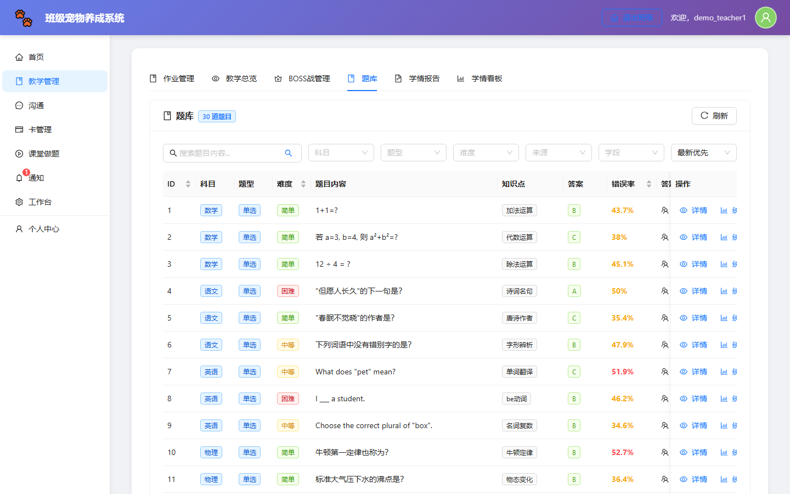

系统内置题库，支持按科目、来源、题型、难度、知识点筛选。

| 来源标记 | 含义 |
|---|---|
| 官方题库 | 系统预置 |
| 个人题库 | 你自己上传/录入的 |
| 班级题库 | 班级共享的题库 |

公开题库所有老师都能看到（不能编辑）；个人题库只有你能看和改。

> 建议：把每学期常用的题整理进个人题库，布置作业时直接取用，比每次 AI 重出更快更稳定。

---

## 六、学情报告与看板

### 6.1 学情报告

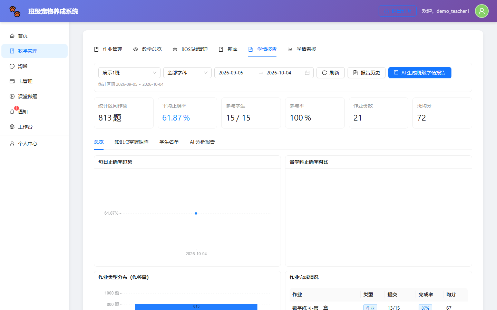

按班级 + 科目 + 时间范围筛选：

- 知识点掌握矩阵（哪些知识点全班掌握不好）
- 学生明细排行
- 单个学生的学情报告

可以导出，也可以生成 AI 学情报告（一段文字总结，可直接发给家长）。

### 6.2 学情看板

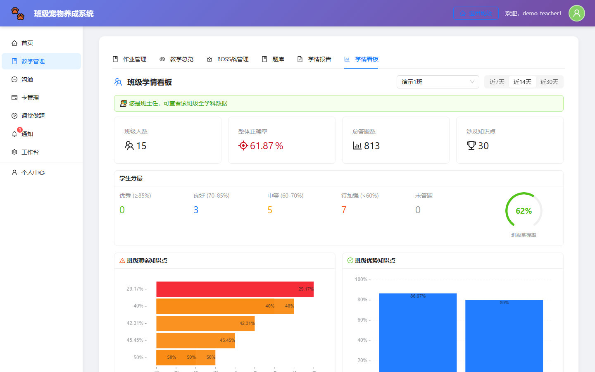

比报告更直观，适合课堂大屏展示：按知识点看全班热力分布、红黑榜。

> 用法建议：课前看学情看板找薄弱点，课中针对性讲，课后看学情报告验证效果。

---

## 七、课堂做题

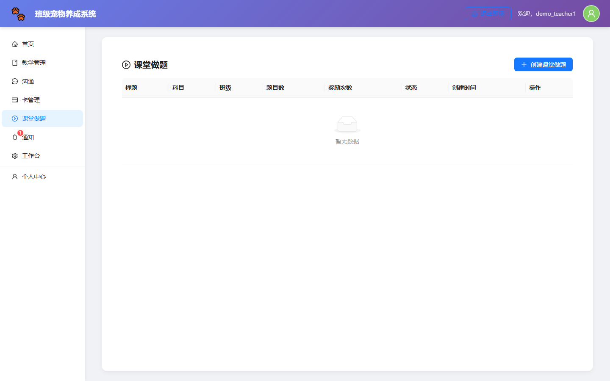

课堂实时答题，适合随堂练习和知识竞赛。

流程：

1. 点「创建练习」，选择班级、科目
2. AI 生成题目（可指定题量），或自己录入
3. 题目出现在屏幕上，学生在自己设备上作答
4. 实时看到答题人数和正确率
5. 课堂结束，点「奖励学生」给答得快、答得对的同学发金币和道具

> 不需要提前布置作业，适合随堂测一测。

---

## 八、BOSS 战管理

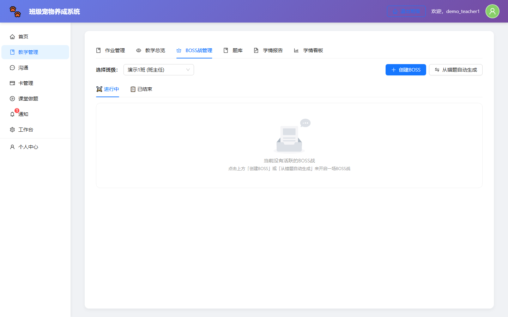

把 BOSS 战变成一个教学活动。

**创建 BOSS：**

1. 点「创建 BOSS」
2. 填 BOSS 名称、形象、等级、简介
3. 设置血量（血量约等于全班要答对多少题才能打倒）
4. 设置持续时间（几小时内有效）
5. 选择题目来源：AI 自动生成 / 手动指定题目
6. 设置奖励（金币、经验、装备）

创建后学生端就能在「宠物中心 → BOSS 战」看到。

**你可以随时：**

- **终止**：提前结束，不再允许挑战
- **删除**：彻底移除（连同学生的答题记录）
- **查看错题**：看全班答错最多的题目，用于讲评

> **强烈建议**：创建时把题目限定在你正在讲的知识范围内。学生打 BOSS 的过程就是你课的延伸。

---

## 九、沟通

### 9.1 班级群聊

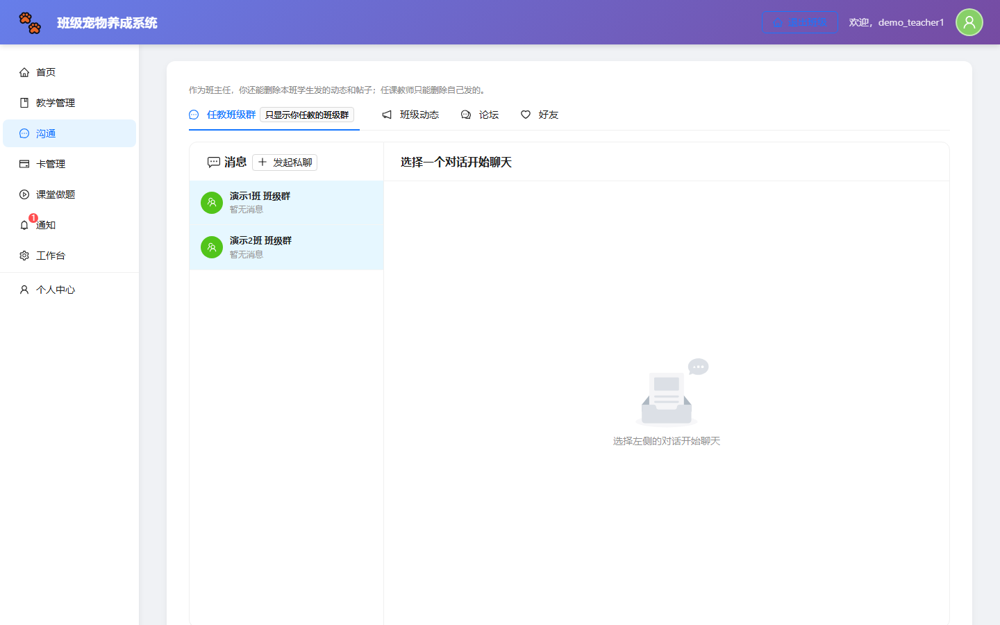

和本班学生聊天，可发文字和图片。学生端只能看到自己班级的群。

### 9.2 班级动态

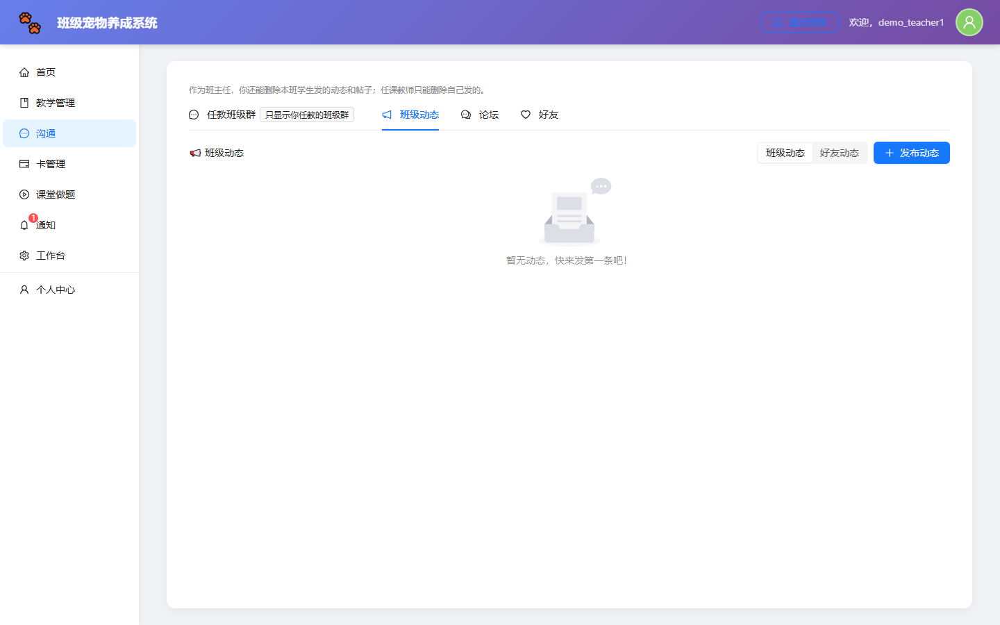

发布班级内的帖子，可评论、点赞、置顶。适合发通知、活动预告。

### 9.3 论坛

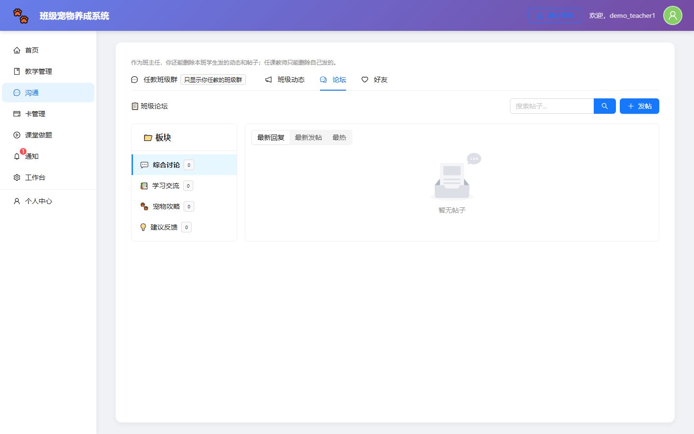

全校范围的公共讨论区。

### 9.4 好友

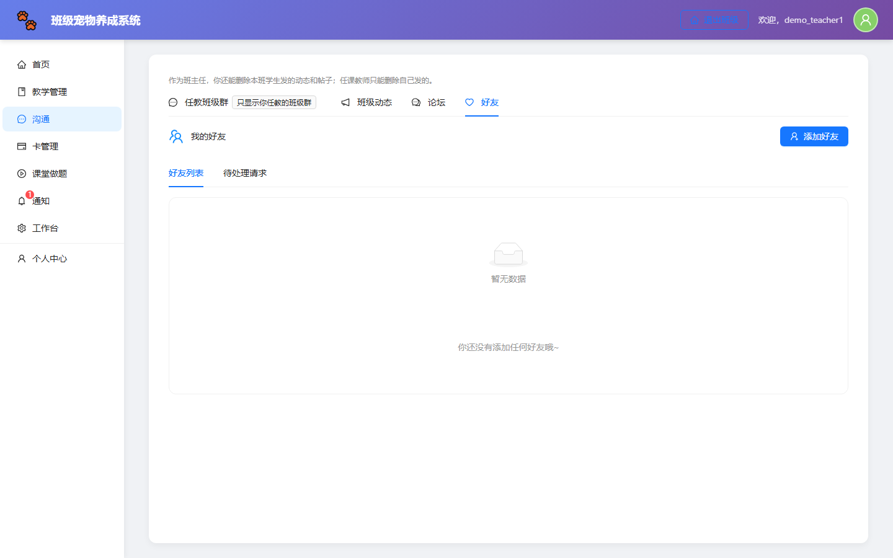

与其他老师建立联系。

---

## 十、卡管理

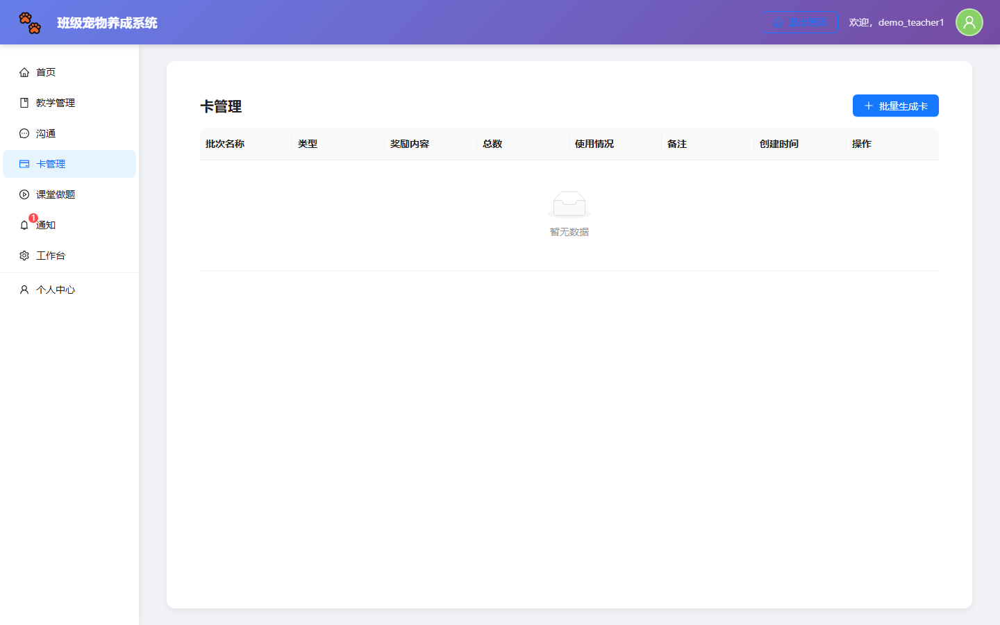

批量生成「卡」，发给学生兑换奖励。

**步骤：**

1. 点「新建卡批次」
2. 设定奖励内容（金币、道具、经验）和数量
3. 系统生成一批**卡号**
4. 复制或导出卡号，打印成纸条发给学生

学生到「卡兑换」页输入卡号即可领取。

| 类型 | 用途 |
|---|---|
| 卡批次 | 一次性批量生成，便于统一发放 |
| 兑换记录 | 查看谁兑换了什么，防止重复使用 |

> 想激励全班？可以设置「全班前 20 名先到先得」的卡号。

---

## 十一、通知与答案更正

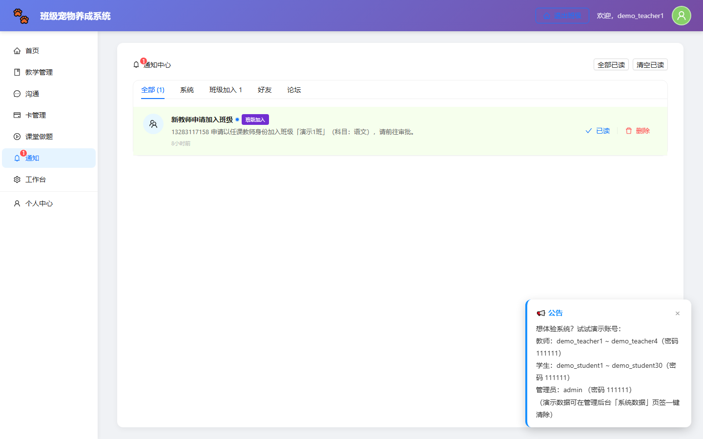

通知分四类，其中 **「答案更正」是教师专用**。

### 答案更正

主观题批改后，给学生发一条「答案更正」通知：

1. 打开「通知 → 答案更正」
2. 选择要更正的作业
3. 填入正确答案和解析
4. 发送

学生收到后会看到「你的答案错了，正确答案是……，解析：……」，并把错题自动收进错题本。

> 建议每次批改主观题后都发一次更正，这比只给个分数有用得多。

---

## 十二、常见问题

**Q1：学生忘了密码怎么办？**
工作台 → 学生管理 → 找到该学生 → 点「重置密码」，系统会生成 6 位临时密码，把它告诉学生即可。

**Q2：怎么快速把一个班的学生加进来？**
两种方式：
- 生成邀请码批量发放（推荐，学生自助注册）
- 学生管理 → 导入，用 Excel 模板或粘贴名单批量创建账号

**Q3：AI 出题失败或提示未配置？**
AI 功能需要管理员先在「管理后台 → AI 设置」里配置。配置完成后你就能正常使用。

**Q4：纸质作业怎么录入？**
两种方式：
- 「纸质登记」：手工录入分数，适合少量
- 「批量扫描」：拍照自动识别，适合整班

**Q5：完成率怎么算的？**
已提交人数 ÷ 应交人数。同一学生同一时段做多份作业只计一次，防止刷完成率。

**Q6：能撤销已发布的作业吗？**
可以，点「取消」作废。但如果已经有学生提交，**学生的记录也会一并失效**，请谨慎使用。

**Q7：学生问我为什么排行榜变了？**
排名依据是综合属性（等级 + 胜场 + 学习数据）。做作业提升等级，等级高了排名自然上升。

**Q8：哪里能看到学生的错题？**
学情报告 → 知识点掌握矩阵，能看到全班在哪个知识点上错得最多。

**Q9：课堂做题需要学生提前准备吗？**
不需要。学生用自己的设备登录系统就能答题，适合随堂使用。

**Q10：如何防止学生刷金币？**
系统已做限制：同一时段多份作业只计一次完成率，生成额度有限制。想要更严格的控制，可在「管理后台 → 网站设置」里调整。

---

*祝教学顺利！有问题请联系学校管理员。*

