# 管理员手册

> 班级宠物养成系统 · 管理员版
> 网址：https://pet2.uwper.cn
> 默认账号：admin ，初始密码 111111（首次登录后请立即修改）

---

## 目录

1. 登录与总览
2. 教师管理
3. 学生管理
4. 班级管理
5. 学校管理
6. 申请审批
7. 公告管理
8. 数据查看与导出
9. 网站设置
10. AI 设置
11. Token 看板
12. 成就管理
13. 系统数据与演示数据
14. 软件升级
15. 清理数据（危险操作）
16. 常见问题

---

## 一、登录与总览

### 1.1 登录

浏览器打开 https://pet2.uwper.cn ，用管理员账号登录。

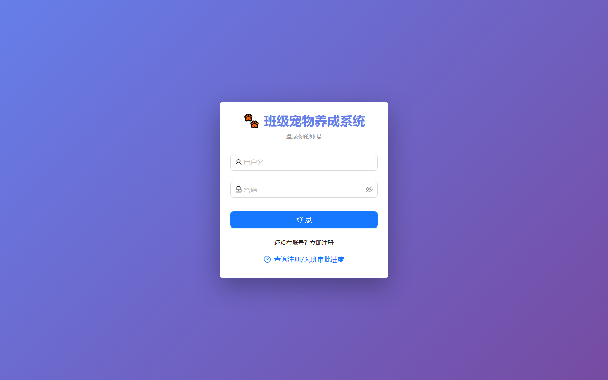

> 初始密码 111111 是公开的默认值，登录后第一件事就是去「个人中心 → 修改密码」改掉。

### 1.2 进入管理后台

登录后点击左侧菜单「管理后台」。

页面上方是所有后台功能的页签，下面逐个介绍。

### 1.3 总览

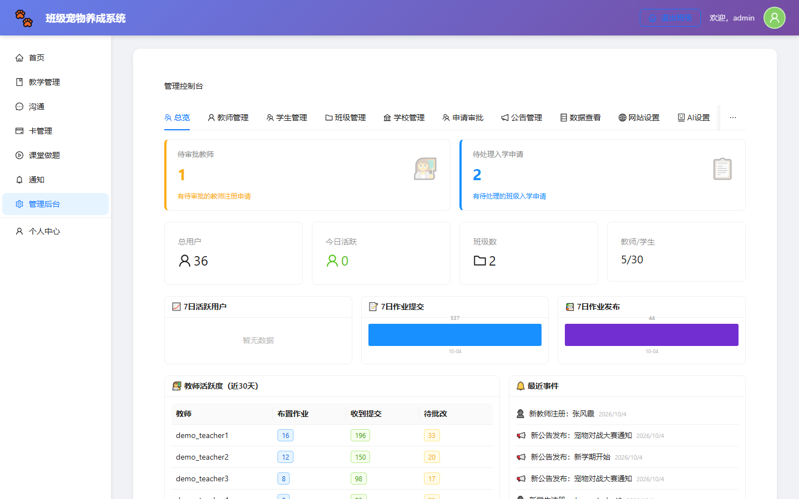

全站运行状况一目了然：注册学生数、班级数、宠物数、战斗次数、作业完成率趋势、Token（AI 额度）消耗情况、系统运行状态。

> 建议每天上班先看一眼总览，特别是「接口异常数」和「AI 额度余量」。

---

## 二、教师管理

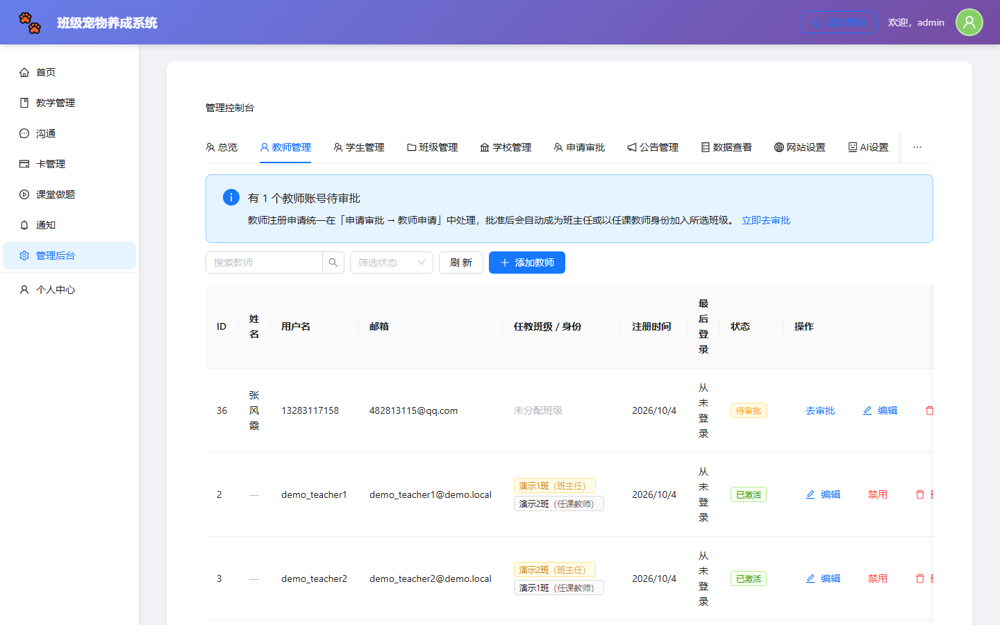

### 2.1 开通教师账号

1. 点「添加教师」，填姓名、账号、初始密码
2. 勾选任教班级（可多选）
3. 保存后把账号密码发给老师

> 老师注册后也可以自己申请任教，在「申请审批」里通过即可。

### 2.2 维护任教信息

在教师列表可以编辑老师的任教班级和身份：

- **班主任**：完整管理权限（布置作业、审批学生、查看全部数据）
- **任课教师**：只能管理自己任教班级的教学功能

同一老师可以任教多个班级，每科可分别设置。

### 2.3 重置密码

老师忘记密码时，点「重置密码」生成临时密码。

---

## 三、学生管理

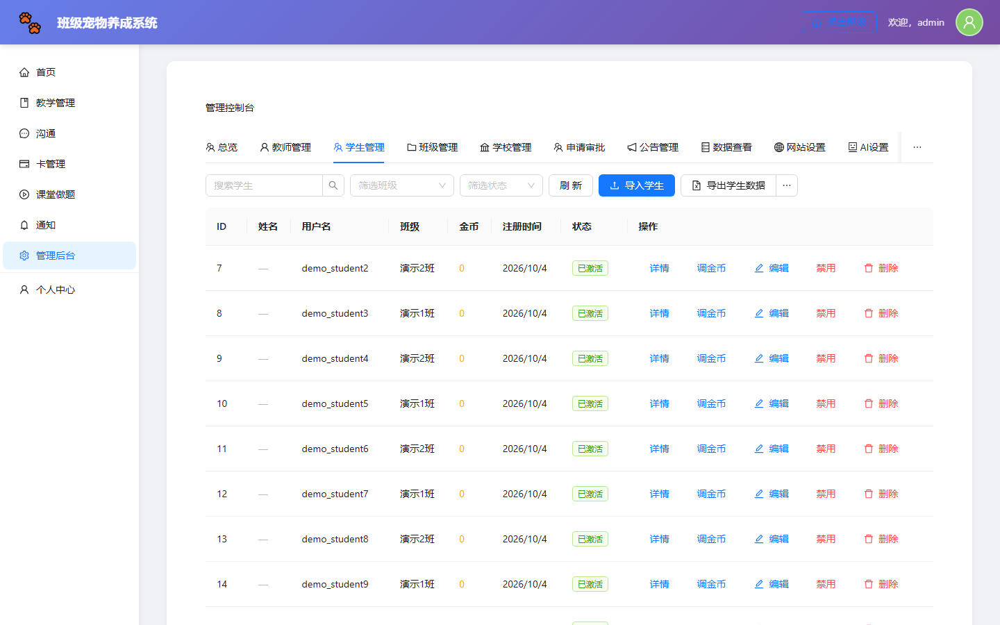

管理员可以查看全校学生，并进行以下操作：

| 操作 | 说明 |
|---|---|
| 搜索 | 按姓名、账号、班级筛选 |
| 查看详情 | 查看该学生的作业记录、正确率、学习数据 |
| 重置密码 | 生成 6 位临时密码 |
| 调整金币 | 手工增加或扣减金币（用于奖励或处罚） |
| 启用/禁用 | 停用账号（学生无法登录，数据保留） |

### 批量导入学生

点「导入学生」，支持两种方式：

- **下载模板**：填好 Excel 后上传
- **粘贴名单**：直接粘贴文本，系统自动识别姓名并生成账号

> 粘贴模式下系统会自动生成账号（如拼音缩写），也可以手动指定。

---

## 四、班级管理

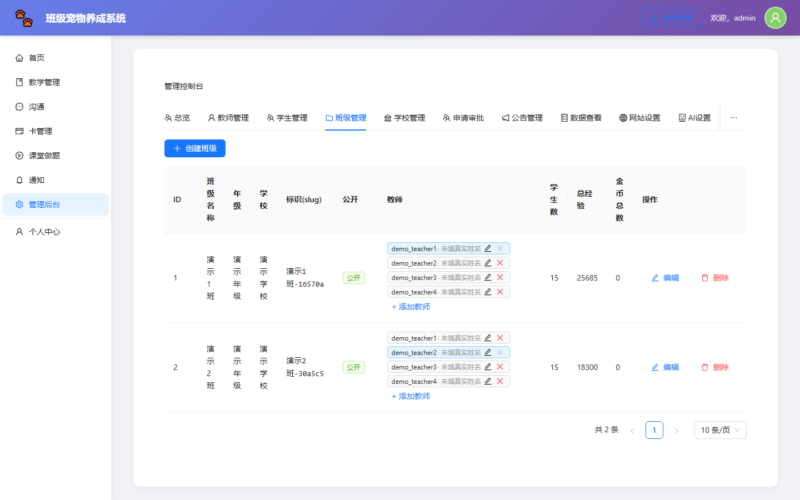

全校所有班级都在这里，可以：

- 新建班级（填名称、年级）
- 编辑班级信息、指定班主任
- 查看班级详情（学生名单、公开主页）
- 删除空班级

> 删除班级前请确认学生已全部转出，否则该班学生数据将无法访问。

---

## 五、学校管理

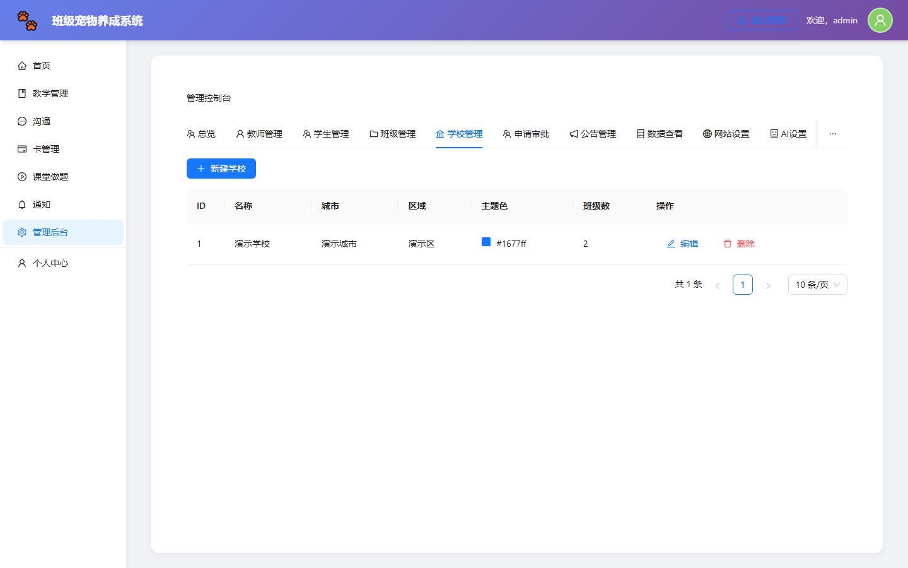

多校区分时使用。可以维护学校列表（名称、城市、地区、校徽、主题色），然后在班级管理中把班级归属到对应学校。

---

## 六、申请审批

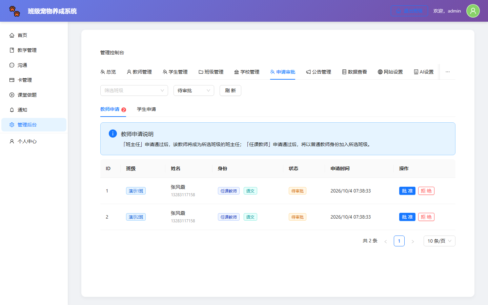

两类申请在这里集中审批：

| 类型 | 说明 |
|---|---|
| 学生入班 | 学生申请加入某个班级 |
| 教师任教 | 老师申请成为某班任课教师 |

点「通过」或「拒绝」，也可直接改学生的任教科目。

---

## 七、公告管理

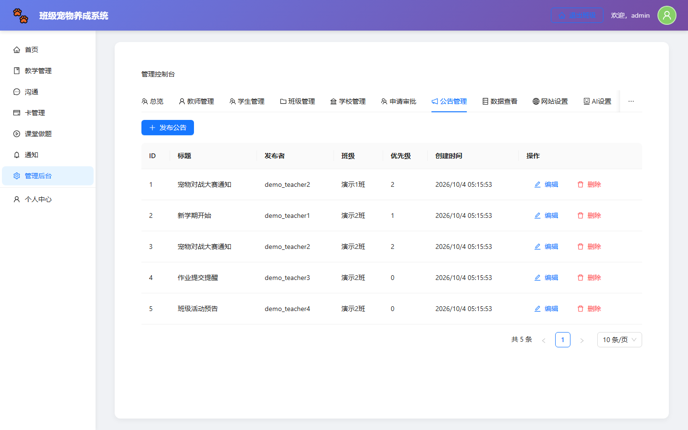

发布面向全校的公告。

- 支持设置**置顶**、**优先级**、**过期时间**
- 可指定接收范围（全校 / 某些班级）
- 学生端在首页右下角以浮层形式看到

> 重要通知建议置顶 + 设置较长有效期。

---

## 八、数据查看与导出

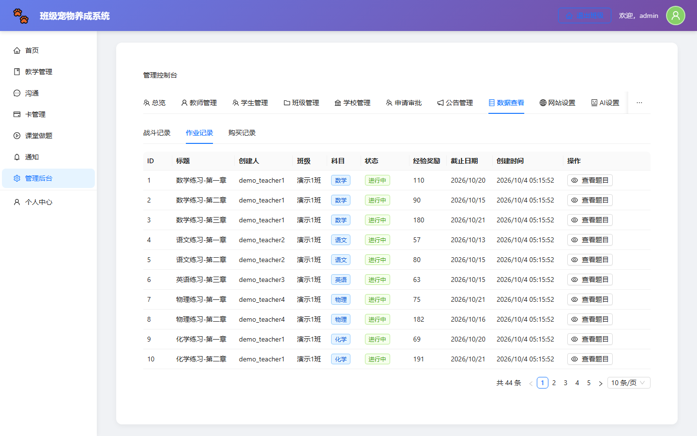

自由组合条件查询数据，并导出为 Excel：

- 可查：学生信息、作业记录、成绩、战斗记录、金币流水
- 条件：班级、科目、时间范围、状态
- 导出：点「导出 Excel」

> 家长会前导出一份班级成绩表即可。

---

## 九、网站设置

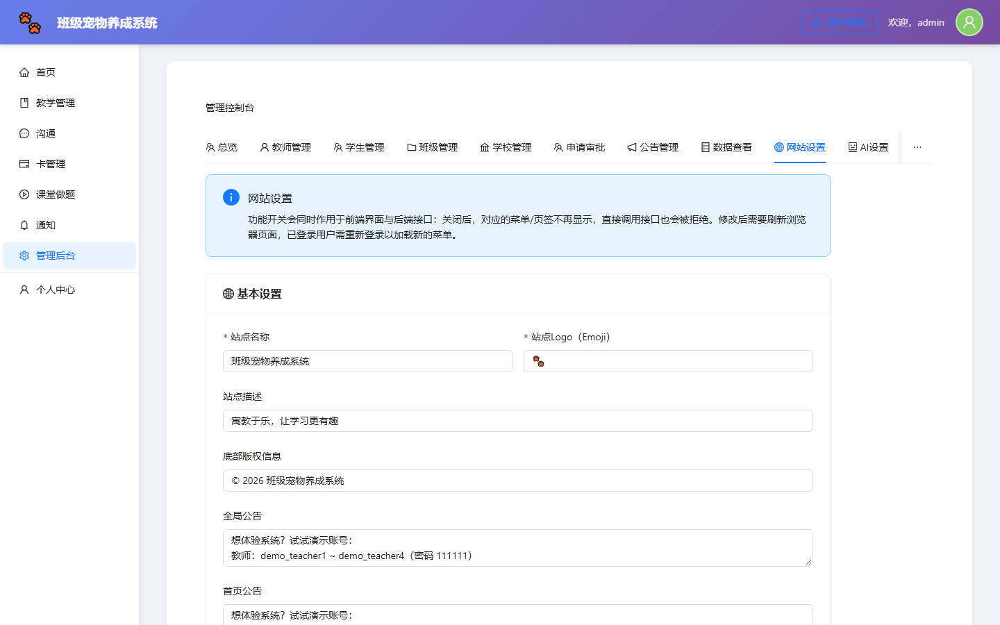

全站级别的参数：

| 设置项 | 说明 |
|---|---|
| 站点名称 | 显示在页面标题和首页 |
| 公告内容 | 首页展示的滚动通知 |
| 排行榜人数 | 排行榜显示前几名 |
| 允许注册 | 关闭后新用户无法自行注册 |
| 注册需审批 | 开启后新注册需管理员审核 |

---

## 十、AI 设置

配置 AI 功能（出题、批改、教练、学情报告）。

需要填：

- **API Key**：服务商提供的密钥
- **接口地址**：API 端点
- **模型**：选择哪些模型可用

配置后可以点「测试连接」验证是否连通。

> **注意**：这里填的值会覆盖环境变量配置，优先以本页面为准。AI 功能不可用时，其余功能不受影响。

---

## 十一、Token 看板

AI 额度的使用情况：

- 今日 / 本周 / 本月消耗
- 每个用户（师生）的消耗排行
- 自己的生成额度上限与剩余

> 额度不足会影响 AI 出题等功能。发现某个老师消耗异常，可以在「学生管理」里限制该账号的生成额度。

---

## 十二、成就管理

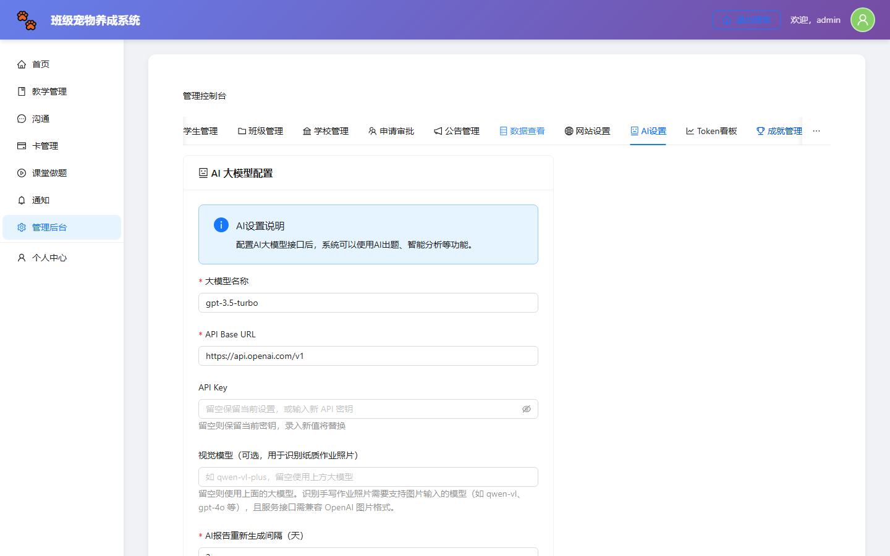

维护成就体系：

- 查看系统内置成就（宠物、战斗、学习、社交、收集、综合六类）
- 新增自定义成就（设定名称、条件、奖励）
- 编辑或停用成就

> 想增加班级特色玩法时，可以自定义一个「连续打卡 7 天」之类的成就。

---

## 十三、系统数据与演示数据

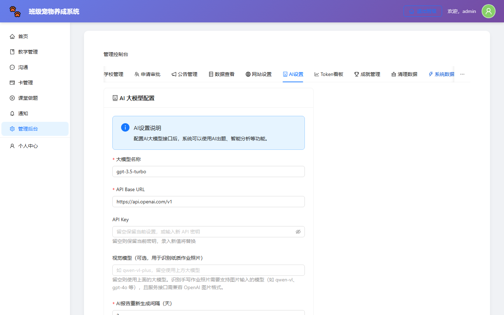

### 13.1 导入演示数据

用于**新系统上线前的老师培训**或**功能演示**：

1. 点「导入演示数据」
2. 等待约 1 分钟
3. 系统会创建 `demo_teacher1`、`demo_student1` 等演示账号和样例数据

演示账号与真实数据互相隔离，**不影响真实学生**。

演示账号清单（密码均为 `111111`）：

| 角色 | 账号 |
|---|---|
| 管理员 | admin |
| 教师 | demo_teacher1、demo_teacher2 |
| 学生 | demo_student1 ~ demo_studentN |

> **演示数据可以随时用「清理数据」页一键清除。**

### 13.2 数据库结构迁移

如果系统提示「数据库结构需要更新」，点「执行迁移」即可。迁移只改表结构，不会动已有数据。

### 13.3 一键重置

仅在新系统正式启用前、或系统异常时使用：**清空所有业务数据并重建初始状态**。此操作不可恢复。

---

## 十四、软件升级

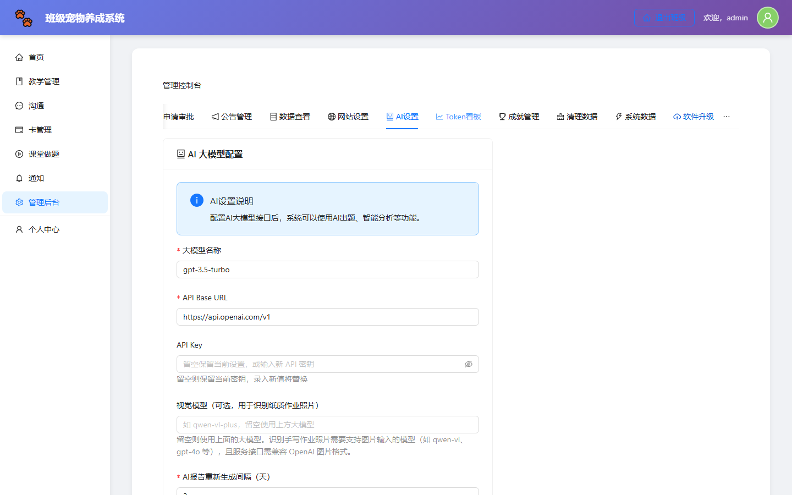

系统自带在线升级能力。

1. 在「更新源地址」填入升级清单地址
2. 点「检查更新」，会显示新版本号和更新内容
3. 确认后点「立即升级」

升级过程自动完成：备份当前程序 → 下载新版本 → 校验完整性 → 写入文件 → 执行数据库迁移。

**升级前系统会自动备份**（保留最近 5 份），出问题可以在「备份列表」里一键回滚。

> 建议：升级前先到「清理数据」页做一次数据库备份；升级后让老师刷新页面确认正常。

---

## 十五、清理数据（危险操作）

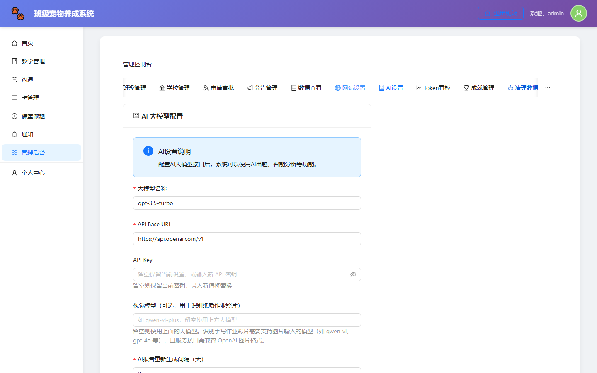

本页操作**不可恢复**，执行前务必确认。

| 功能 | 用途 | 影响 |
|---|---|---|
| 清空演示数据 | 删除所有 demo_* 账号及样例数据 | 仅影响演示数据 |
| 清空 AI 报告 | 删除已生成的 AI 学情报告 | 不影响作业和成绩 |
| 整体重置系统 | **清空所有业务数据**（学生、作业、成绩、宠物…） | **全部数据消失** |

> **执行「整体重置」前请务必先做数据库备份。**

---

## 十六、常见问题

**Q1：初始密码是多少？**
admin / 111111。登录后请立即在「个人中心 → 修改密码」修改。

**Q2：新老师怎么开通？**
教师管理 → 添加教师，指定任教班级后把账号密码发给老师。

**Q3：学生自己注册了但进不了班？**
在「申请审批」里通过他的入班申请，或直接用「学生管理 → 调整班级」把他放进某个班。

**Q4：AI 功能报错/用不了？**
检查「AI 设置」里的 API Key 和接口地址，点「测试连接」验证。配置无误仍失败时，可能是额度耗尽或网络问题。

**Q5：怎么防止学生乱注册？**
「网站设置」里关闭「允许注册」，然后由管理员统一开通账号。

**Q6：如何备份数据？**
清理数据页有数据库备份功能，建议每次批量操作前点一次备份。

**Q7：升级后页面异常怎么办？**
到「软件升级 → 备份列表」选择升级前的备份，点回滚即可恢复。

**Q8：忘记管理员密码怎么办？**
联系技术人员通过服务器重置，或使用数据库工具修改。

**Q9：可以同时部署两套系统给不同学校吗？**
可以，两套系统数据完全独立，互不影响。管理员为每套系统分别配置 AI 设置与公告即可。

**Q10：如何查看全站使用情况？**
「总览」页看整体数据，「数据查看」页可导出明细做进一步分析。

---

*祝使用顺利！*

